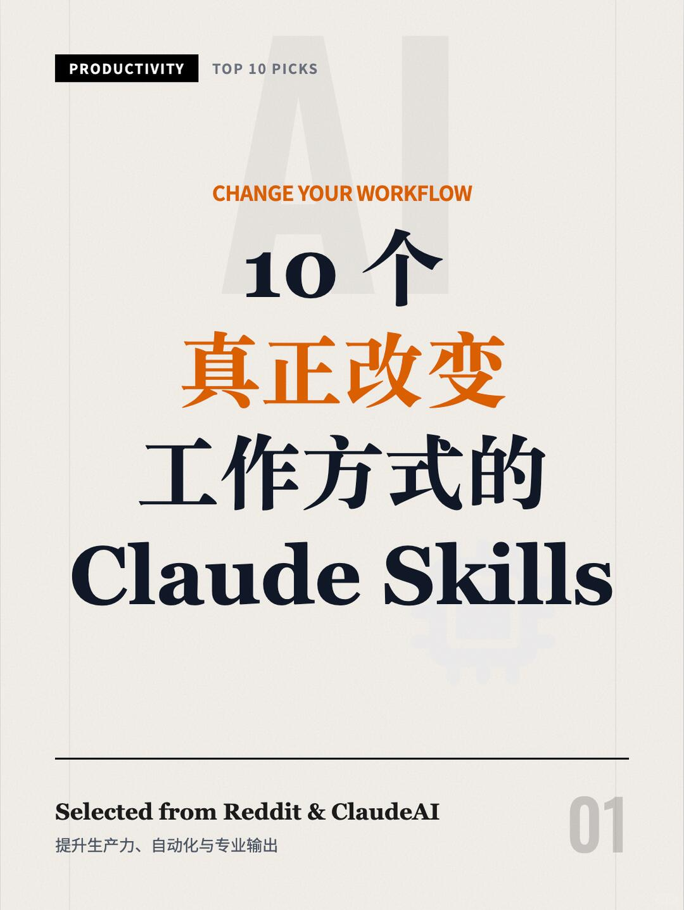
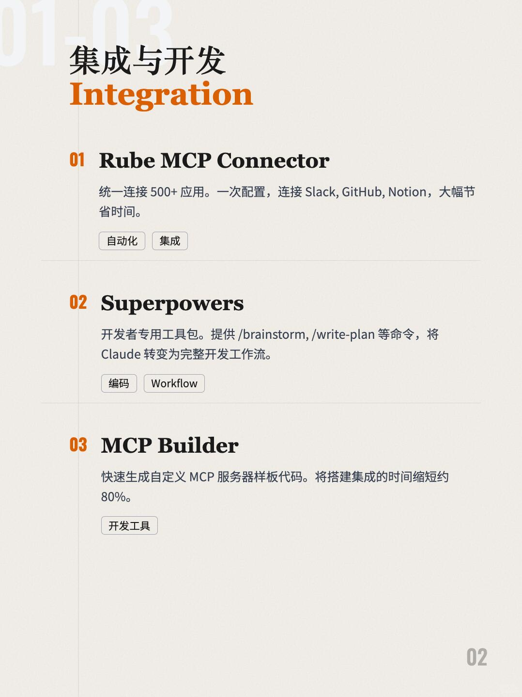
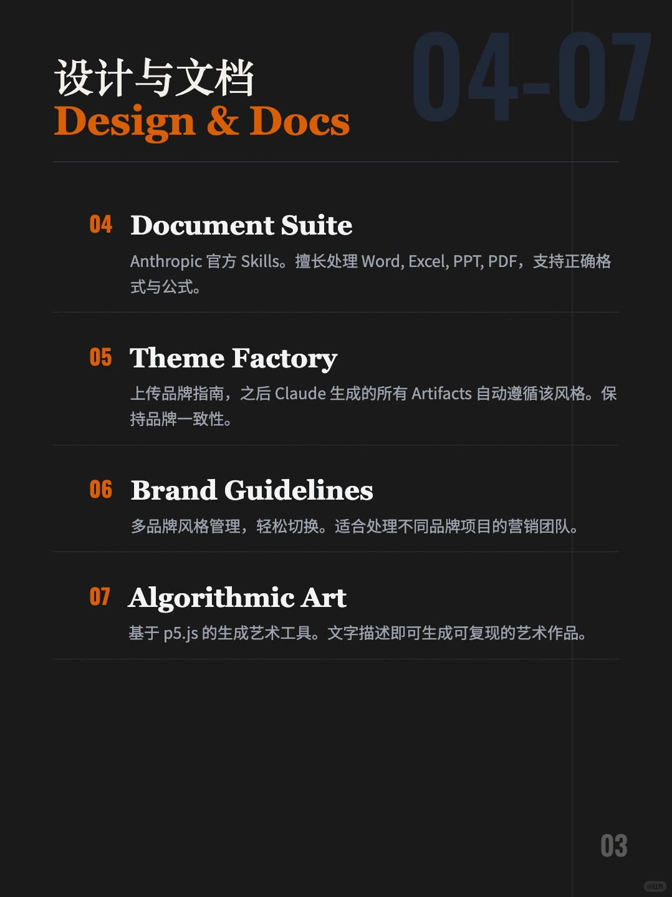
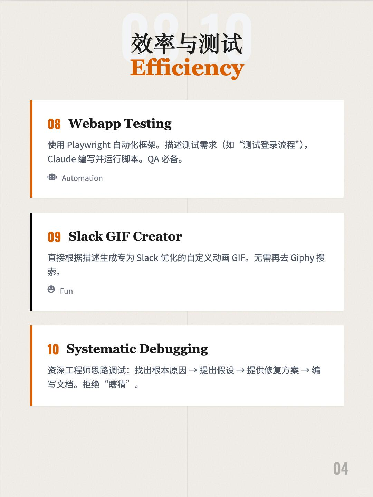
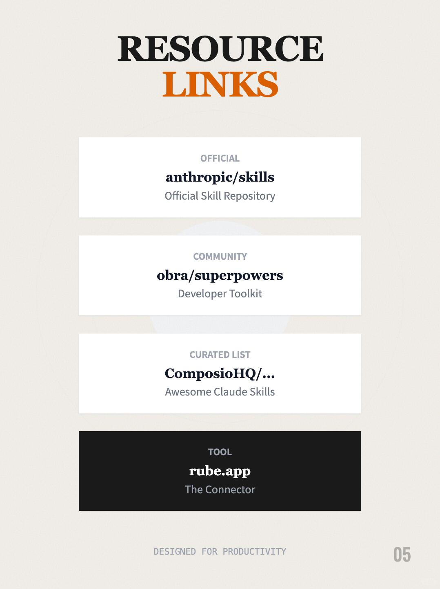

# 10 个真正改变我工作方式的 Claude Skills



Reddit/ClaudeAI 中看到的帖子，总结了持续测试后真正觉得有价值的 10 个 Skills，聚焦于提升生产力、自动化和专业输出，涵盖开发、文档、设计、测试等场景。
	
1. Rube MCP Connector
通过一个统一的 MCP 服务器，将Claude一次性连接到 500+ 应用（Slack、GitHub、Notion 等），无需为每个应用单独配置认证。适合需要大量自动化集成的用户，大幅节省时间。
	
2. Superpowers（obra）
提供 /brainstorm、/write-plan、/execute-plan 等专用命令，将 Claude 从普通聊天机器人转变为完整的开发工作流辅助工具。对严肃编码的人来说是重大提升。
	
3. Document Suite（Anthropic 官方）
让 Claude 真正擅长处理和创建 Word、Excel、PowerPoint、PDF 文件，支持正确格式、公式等，而不仅仅是读取。处理客户发来的复杂文件时特别实用。
	
4. Theme Factory
一次性上传品牌指南（颜色、字体等），之后 Claude 生成的所有 Artifacts 都会自动遵循该风格。非常适合营销团队保持品牌一致性。
	
5. Algorithmic Art
基于 p5.js 的生成艺术工具，只需文字描述，即可生成可复现的艺术作品。适合创意编码者。
	
6. Slack GIF Creator
直接根据描述生成专为 Slack 优化的自定义动画 GIF，无需再去 Giphy 搜索。实用且有趣的小工具。
	
7. Webapp Testing 使用 Playwright 自动化框架，描述测试需求，Claude 就能编写并运行测试脚本。QA 工程师和开发者会觉得特别好用。
	
8. MCP Builder
快速生成自定义 MCP 服务器的样板代码，将搭建集成的时间缩短约80%。适合自己开发 Skills 或复杂集成的用户。
	
9. Brand Guidelines
与 Theme Factory 类似，但支持同时管理多个品牌风格，并轻松切换。适合需要处理不同品牌项目的团队。
	
10. Systematic Debugging
让 Claude 按资深工程师的思路系统化调试：找出根本原因 → 提出假设 → 提供修复方案 → 编写文档。避免了以往“瞎猜式”调试。

```
#ai# #人工智能# #skills#
```






