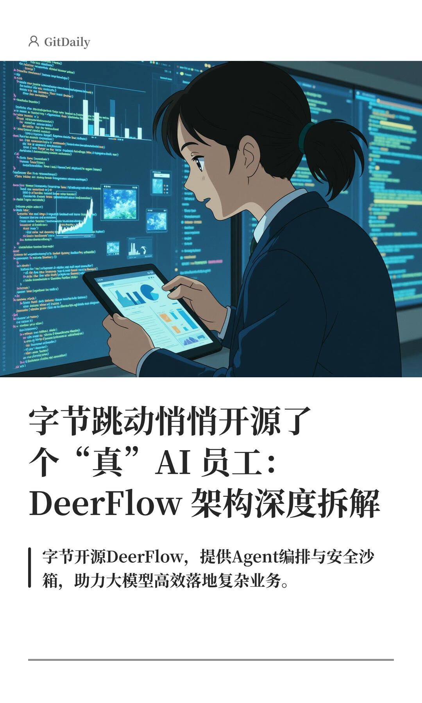
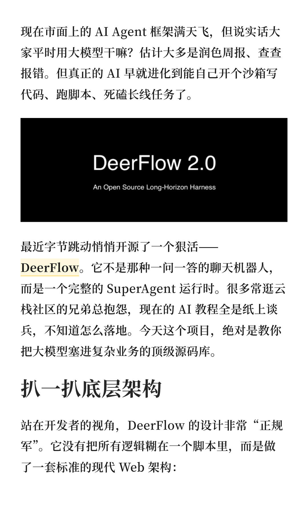
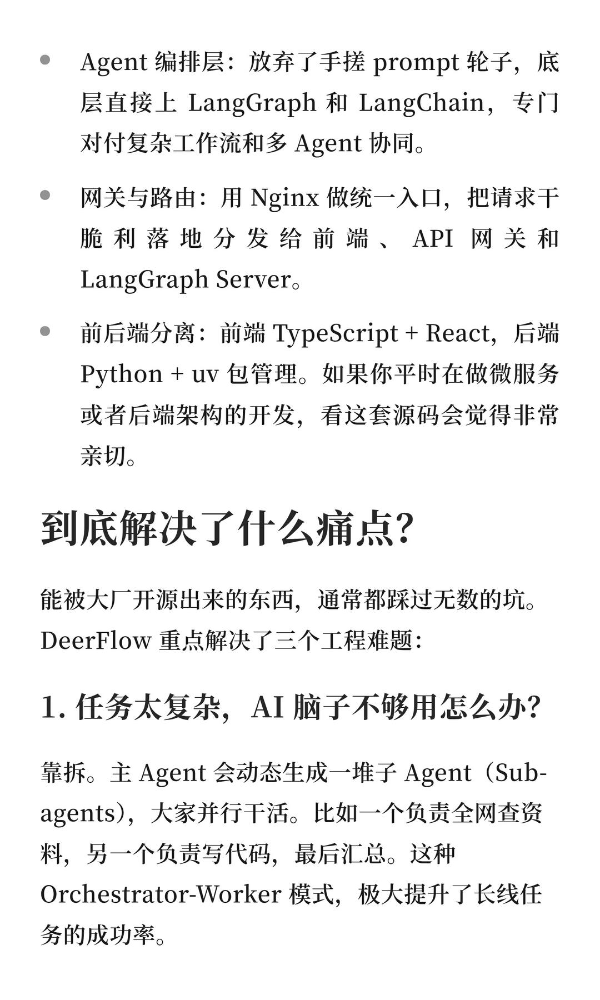
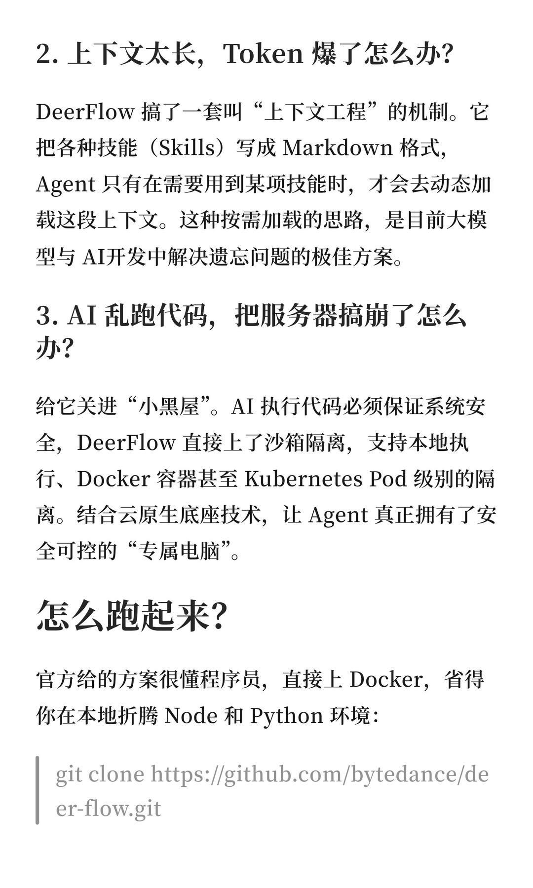
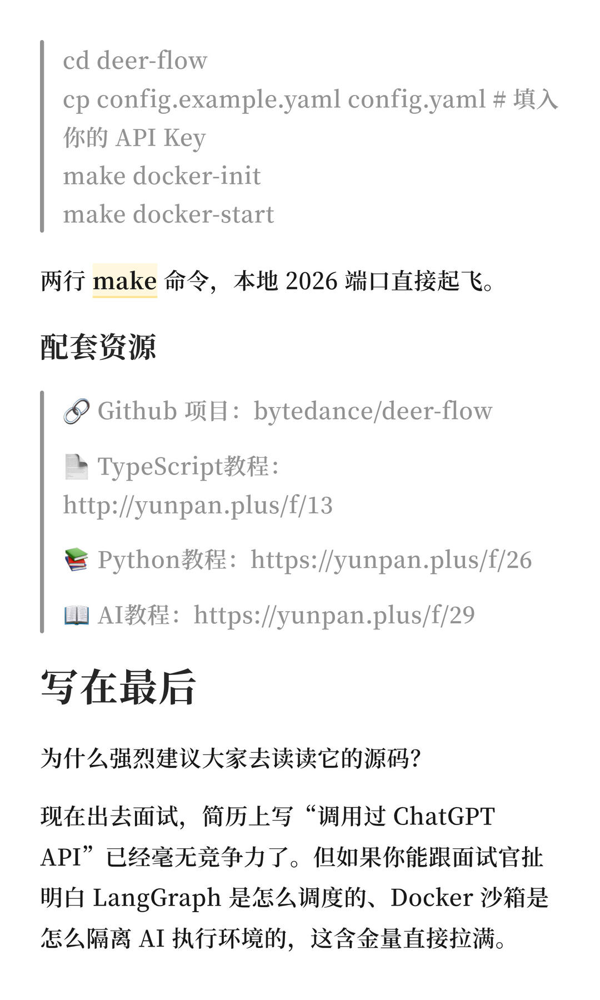
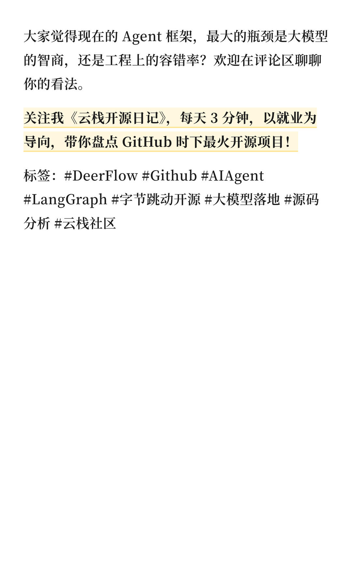

# DeerFlow：字节悄悄开源了个“真” AI 员工



字节跳动开源的 DeerFlow 是一个基于 LangGraph 的企业级 AI Agent 框架。它通过子智能体协同、动态技能按需加载和 Docker/K8s 沙箱隔离机制，让 AI 能安全自主地执行复杂长线任务，是学习大模型工程化落地的极佳源码库。
	
标签：

```
#DeerFlow# #aiagent# #langgraph# #字节跳动开源项目# #大模型落地# #源码分析# #云栈社区# #小红书科技AMA# #互联网大厂# #未来工作趋势#
```







