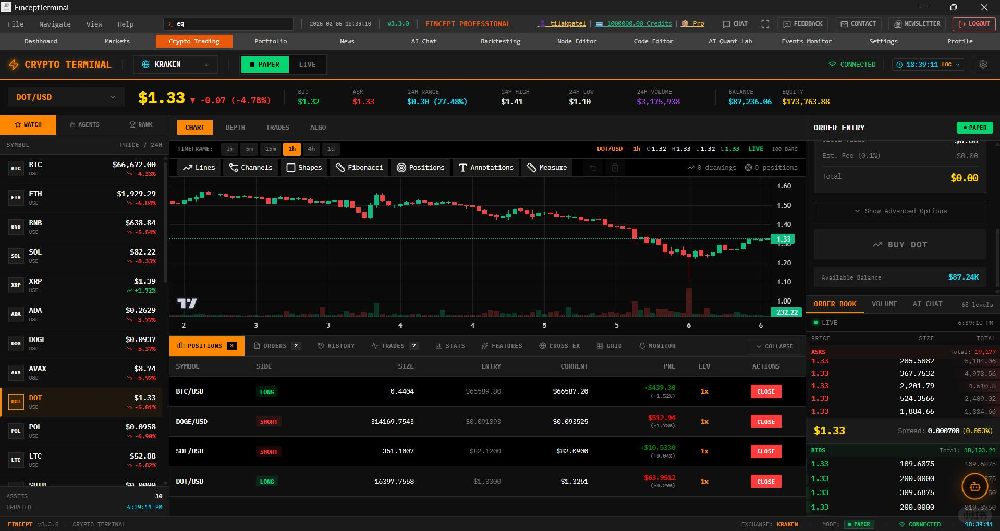

# 【开源】Fincept Terminal 是一个现代化的 开放源码金融分析平台，旨在为个人投资者、交易员和分析师提供专业级市场分析、投资研究以及经济数据工具。在一个统一环境里，它将实时市场数据、AI 驱动洞察、技术和基本面分析集成起来，支持交互式探索和基于数据的决策制定。  核心特点 •	📊 CFA 水平分析模块 — 包括净现值模型（DCF）、投资组合优化、风险指标（如 VaR、Sharpe比率）等高级金融分析工具。  •	🤖 AI 驱动洞察 — 内置多种投资者角色代理与对冲基金策略模拟，可结合本地 LLM 生成智能研究结论。  •	🌐 无限制数据接入 — 支持超过 100+ 数据连接器，包括市场数据、数据库、流媒体等，实现跨域分析。  •	🔁 跨域智能关联 — 可将供应链、地缘政治、海运跟踪等多领域数据联合分析，用于构建专有投资指标。  •	🛠 可视化工作流与自动化 — 提供视觉节点编辑器、Python 代理编排及 MCP 工具集成，用于构建无代码&#x2F;低代码的分析流程。  •	💡 现代技术栈与跨平台支持 — 使用 Tauri、React、TypeScript 等构建，支持 Windows、macOS 和 Linux。  库名&#x2F;项目名 Fincept-Corporation &#x2F; FinceptTerminal #人工智能 #量化交易 #股市



【开源】Fincept Terminal 是一个现代化的 开放源码金融分析平台，旨在为个人投资者、交易员和分析师提供专业级市场分析、投资研究以及经济数据工具。在一个统一环境里，它将实时市场数据、AI 驱动洞察、技术和基本面分析集成起来，支持交互式探索和基于数据的决策制定。 
核心特点
•	📊 CFA 水平分析模块 — 包括净现值模型（DCF）、投资组合优化、风险指标（如 VaR、Sharpe比率）等高级金融分析工具。 
•	🤖 AI 驱动洞察 — 内置多种投资者角色代理与对冲基金策略模拟，可结合本地 LLM 生成智能研究结论。 
•	🌐 无限制数据接入 — 支持超过 100+ 数据连接器，包括市场数据、数据库、流媒体等，实现跨域分析。 
•	🔁 跨域智能关联 — 可将供应链、地缘政治、海运跟踪等多领域数据联合分析，用于构建专有投资指标。 
•	🛠 可视化工作流与自动化 — 提供视觉节点编辑器、Python 代理编排及 MCP 工具集成，用于构建无代码/低代码的分析流程。 
•	💡 现代技术栈与跨平台支持 — 使用 Tauri、React、TypeScript 等构建，支持 Windows、macOS 和 Linux。 
库名/项目名
Fincept-Corporation / FinceptTerminal

```
#人工智能# #量化交易# #股市#
```


