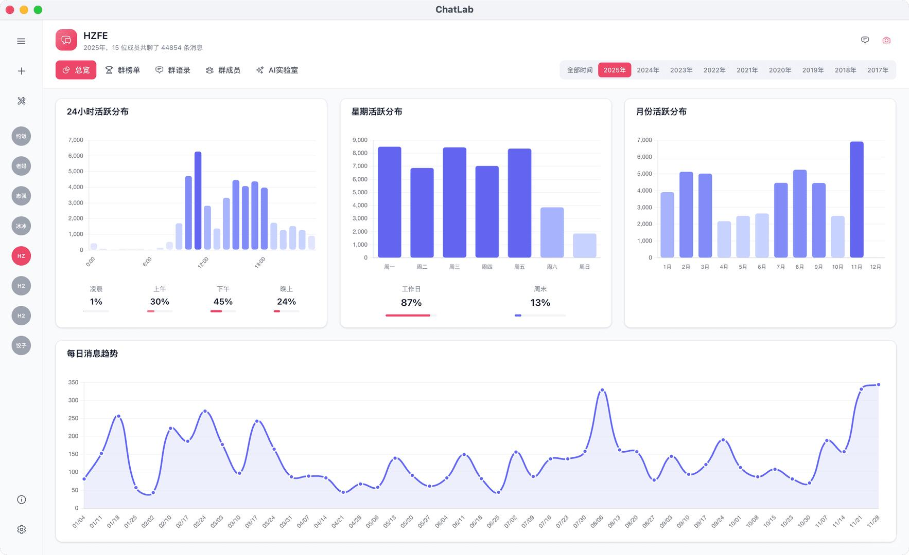
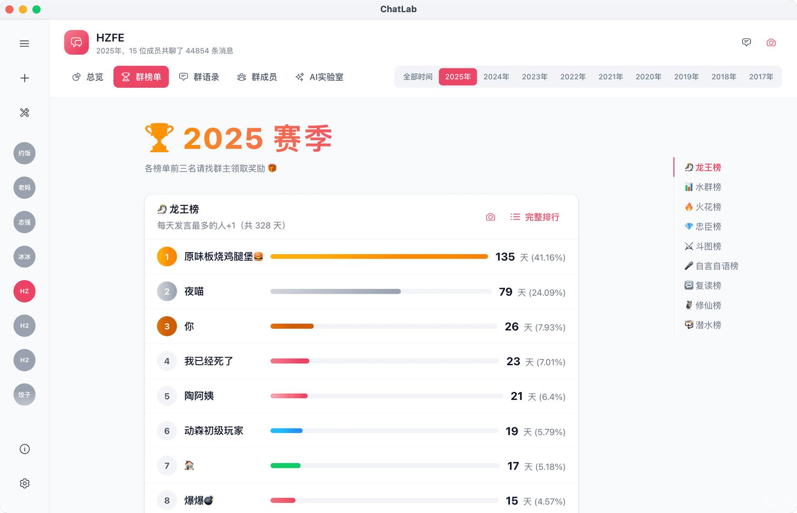
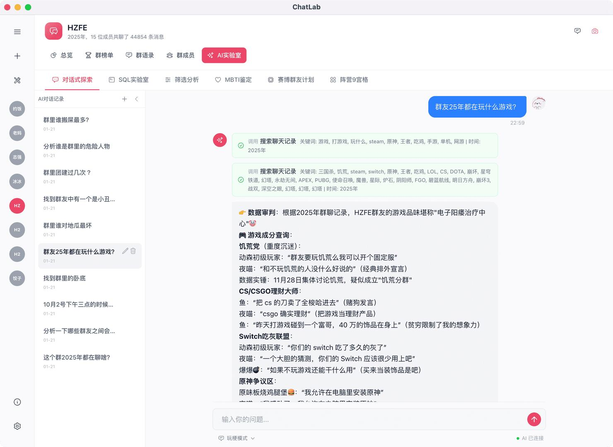

# 开源的本地化AI聊天记录分析工具：ChatLab

ChatLab是一款专注于聊天记录深度分析的开源项目，支持微信、QQ、WhatsApp等主流聊天软件的数据导入。
	
其核心理念是“你的数据，你做主”，所有分析操作均在本地完成，无需上传至任何服务器，即使离线环境也能正常运行。
	
功能特点
	
多平台格式兼容
无论用户导出的是微信JSON格式、QQ TXT文本还是WhatsApp导出包，ChatLab都能自动识别并进行结构化处理，通过“标准化抽象层”抹平不同平台在格式、字段、时间戳等方面的差异。
	
隐私保护与本地化处理
ChatLab采用彻底的本地化处理方案，所有聊天数据存储在本地SQLite数据库中，分析过程完全离线运行（AI功能除外），从根本上杜绝了隐私泄露风险。
	
智能AI助手与自然语言查询
内置AI SQL模式，用户只需用自然语言描述分析需求，系统就能自动生成SQL查询并返回结果。如输入“群里谁最喜欢吃麦当劳”，系统会立即生成相应的查询语句并展示结果。
	
开源地址可在GitHub查看~

