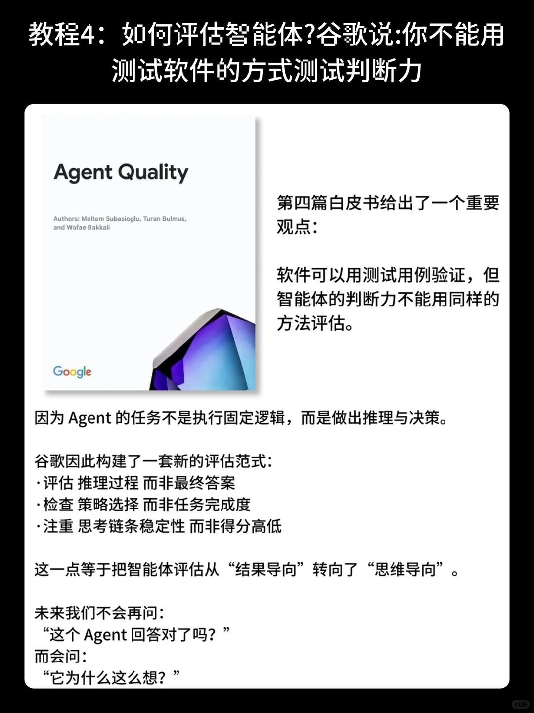
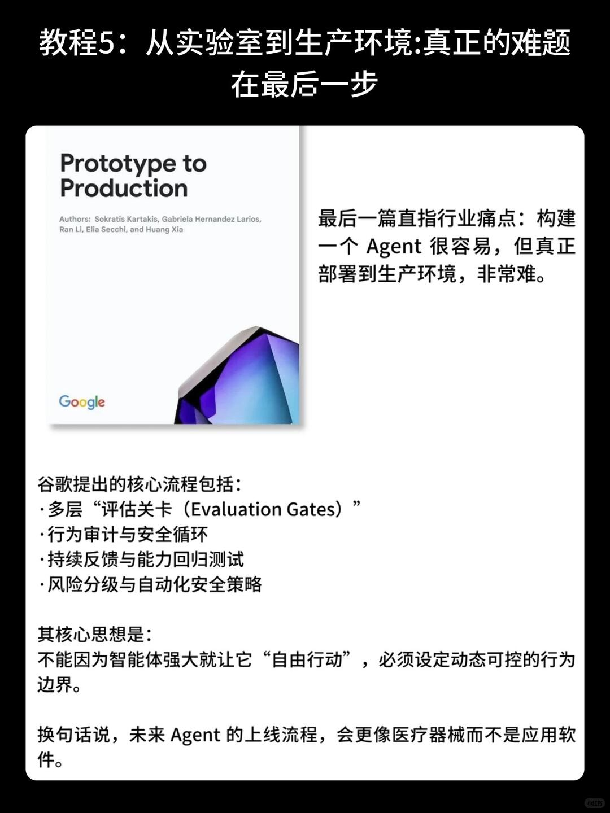

# 谷歌封神5部白皮书：AI Agent系列教程双语


Google近期发布了五本关于AI智能体的白皮书，内容比较系统，涵盖了从基础概念到实践应用的多个方面：
	
1. 《AI智能体入门》
2. 《智能体工具与MCP》
3. 《上下文工程》
4. 《智能体的质量》
5. 《原型到产品》
	
这套资料整理了中英双语版本，对开发者和产品经理来说，可以作为了解Agent技术架构和工程实践的参考。如果你正在关注这个方向，这份材料或许能帮助你更清晰地构建学习路径。

```
#智能体# #智能体设计模式# #人工智能就业# #ai智能体# #个人开发者# #人工智能未来# #智能体搭建# #智能体工作流#
```




