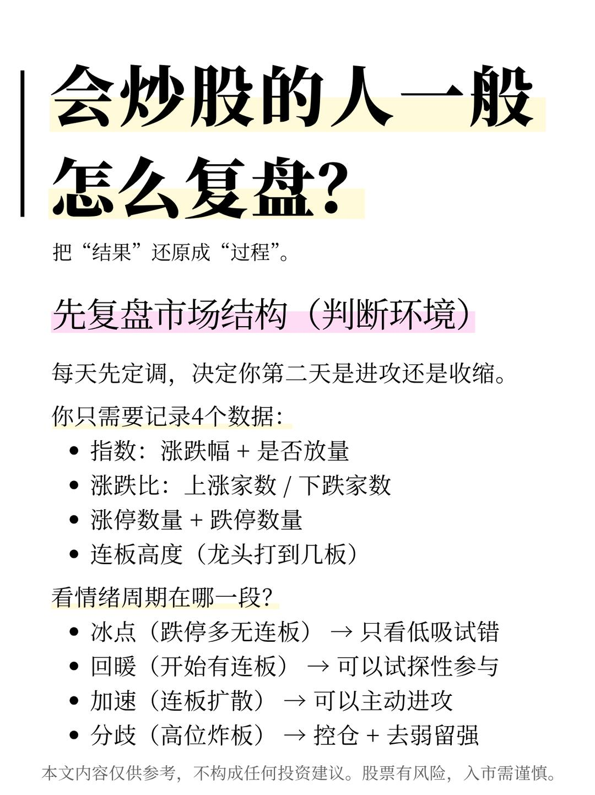
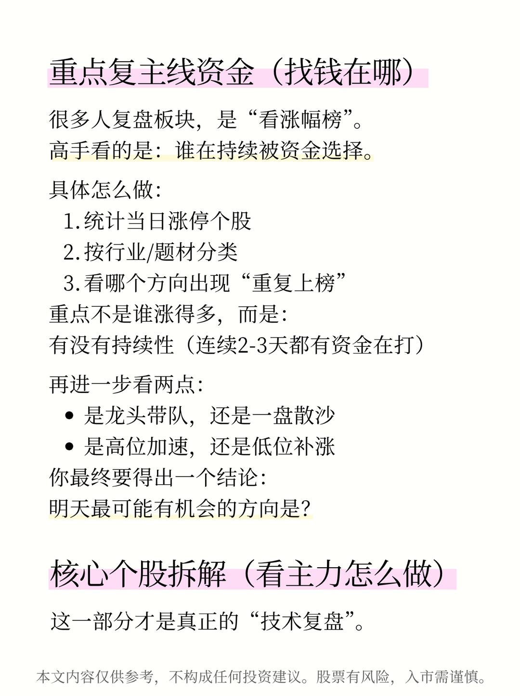
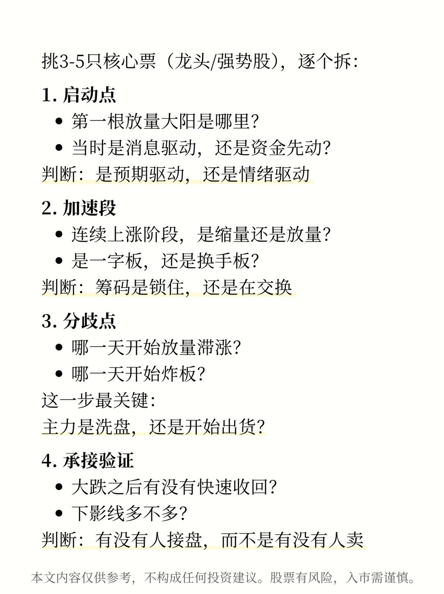
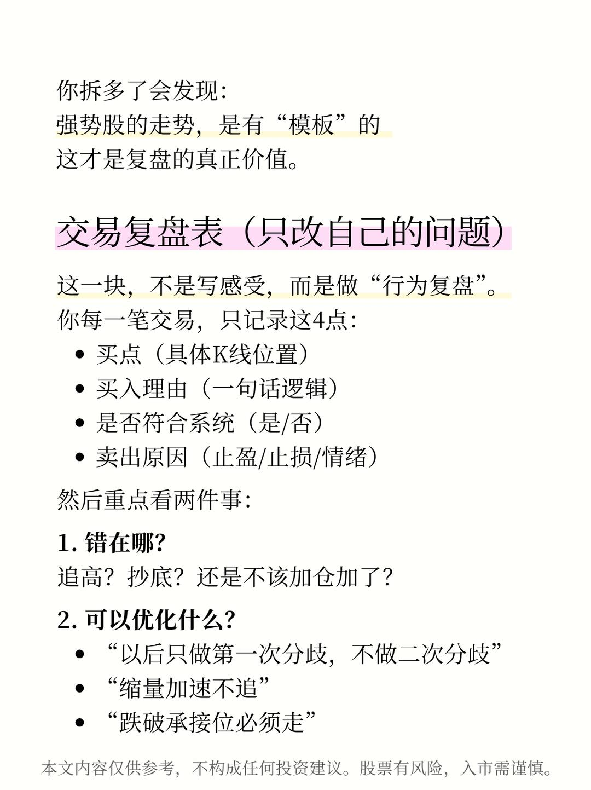
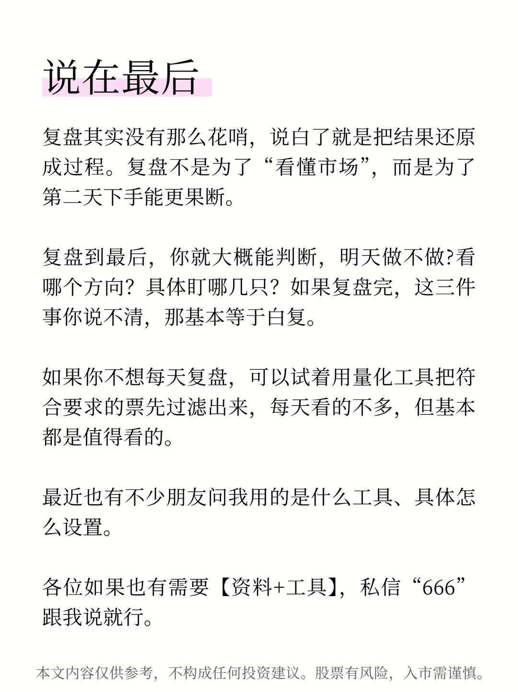

# 炒股厉害的人怎么复盘



复盘其实没有那么复杂，说白了就是把结果还原成过程。复盘不是为了“看懂市场”，而是为了第二天下手能更果断。
	
复盘到最后，你就大概能判断，明天做不做？看哪个方向？具体盯哪几只？如果复盘完，这三件事你说不清，那基本等于白复。
	
如果你不想每天复盘，可以试着用量化工具把符合要求的票先过滤出来，每天看的不多，但基本都是值得看的。
	
最近也有不少朋友问我用的是什么量化工具、具体怎么操作。
	
各位如果也有需要【资料+工具】，私信“666跟我说就行。

```
#股票知识# #股票投资# #股市# #复盘# #每日复盘# #行情# #股票# #炒股# #小白来理财#
```







