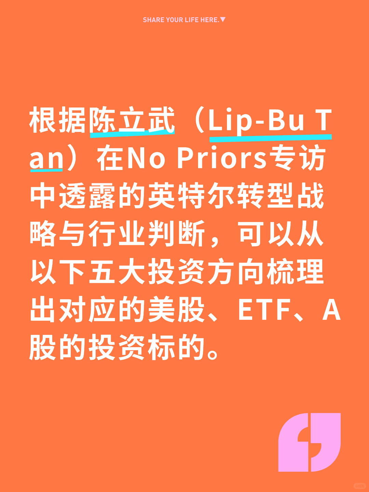
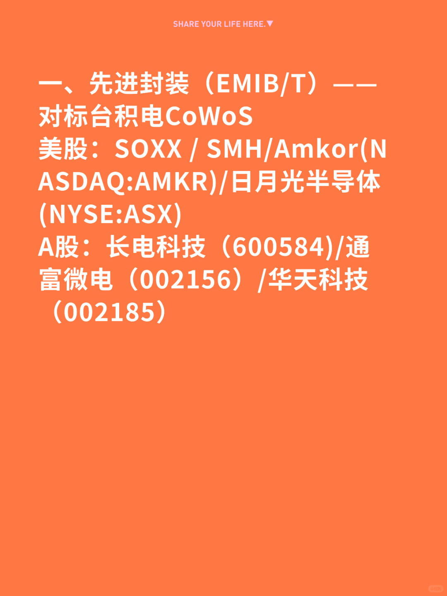
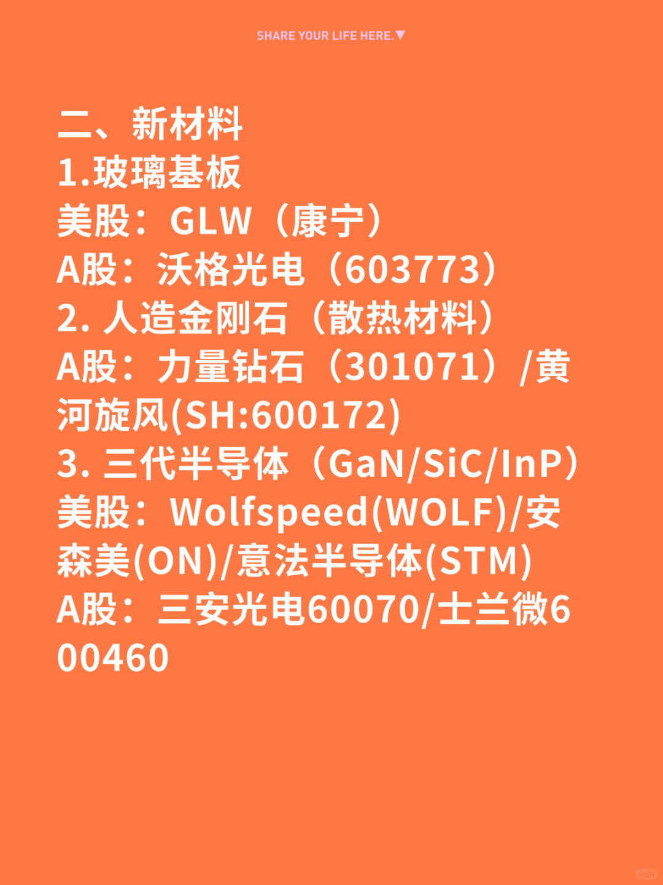
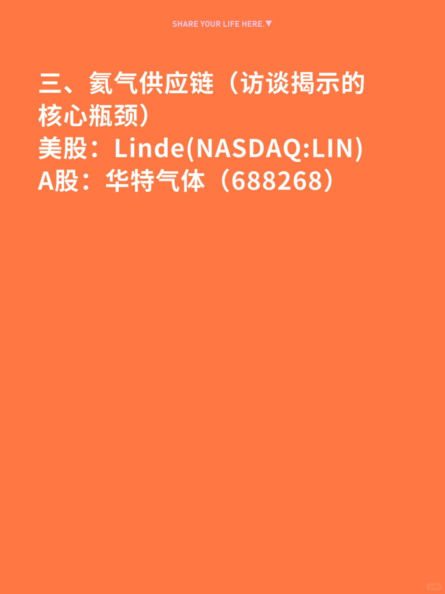
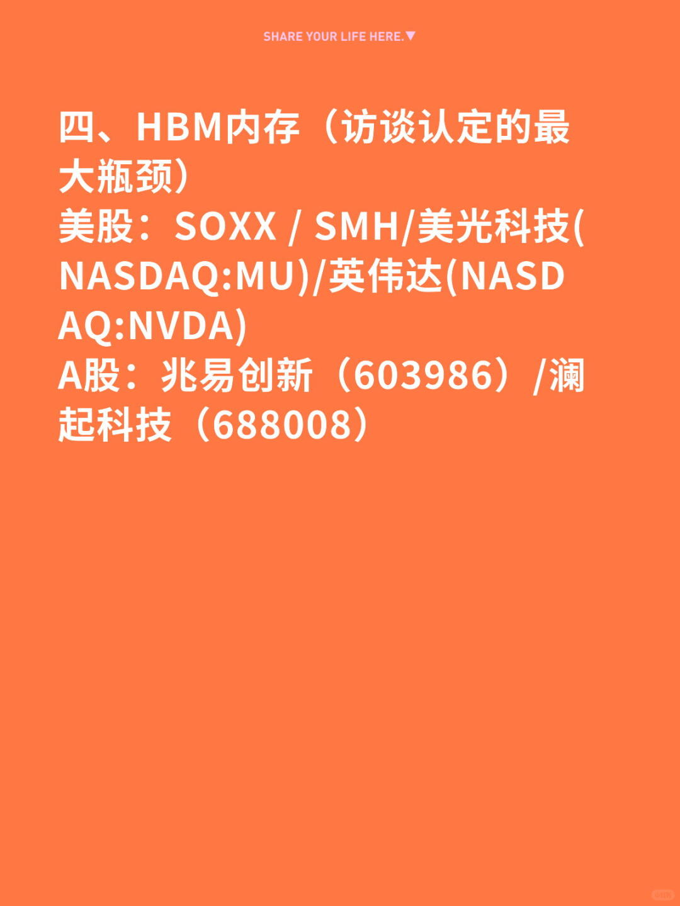
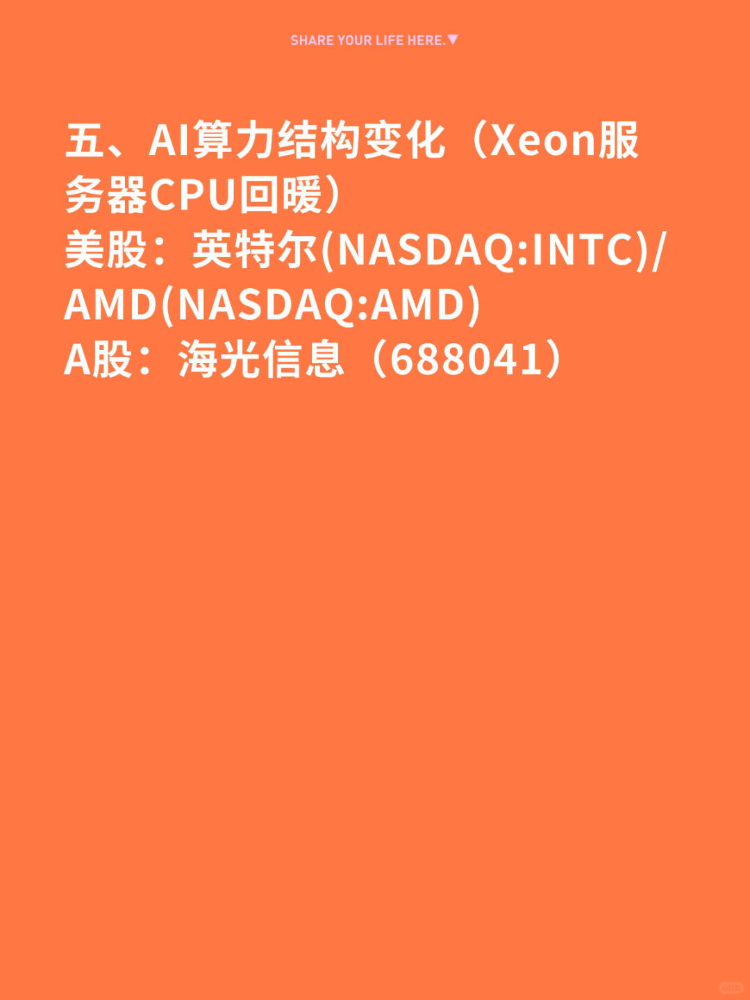
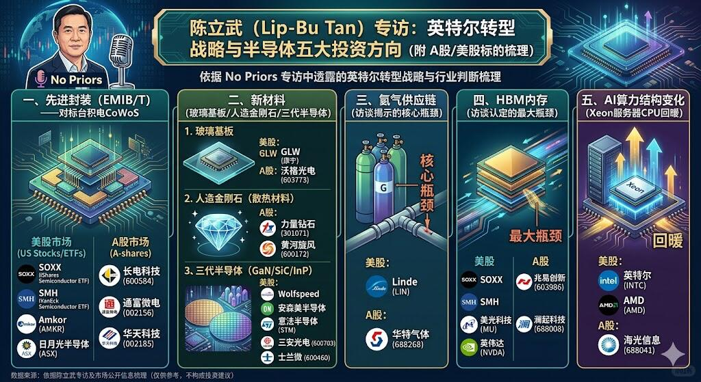

# 英特尔CEO陈立武访谈透露的五大投资方向



根据陈立武（Lip-Bu Tan）在No Priors专访中透露的英特尔转型战略与行业判断，可以从以下五大投资方向梳理出对应的美股、ETF、A股标的。
一、先进封装（EMIB/T）——对标台积电CoWoS
美股：SOXX / SMH/Amkor(NASDAQ:AMKR)/日月光半导体(NYSE:ASX)
A股：长电科技（600584)/通富微电（002156）/华天科技（002185）
二、新材料（玻璃基板/人造金刚石/三代半导体）
1.玻璃基板
美股：GLW（康宁）
A股：沃格光电（603773）
2. 人造金刚石（散热材料）
A股：力量钻石（301071）/黄河旋风(SH:600172)
3. 三代半导体（GaN/SiC/InP）
美股：Wolfspeed(NYSE:WOLF)/安森美半导体(NASDAQ:ON)/意法半导体(NYSE:STM)
A股：三安光电（600703）/士兰微（600460）
三、氦气供应链（访谈揭示的核心瓶颈）
美股：Linde(NASDAQ:LIN)
A股：华特气体（688268）
四、HBM内存（访谈认定的最大瓶颈）
美股：SOXX / SMH/美光科技(NASDAQ:MU)/英伟达(NASDAQ:NVDA)
A股：兆易创新（603986）/澜起科技（688008）
五、AI算力结构变化（Xeon服务器CPU回暖）
美股：英特尔(NASDAQ:INTC)/AMD(NASDAQ:AMD)
A股：海光信息（688041）

```
#英特尔# #陈立武# #半导体# #芯片# #投资理财#
```








