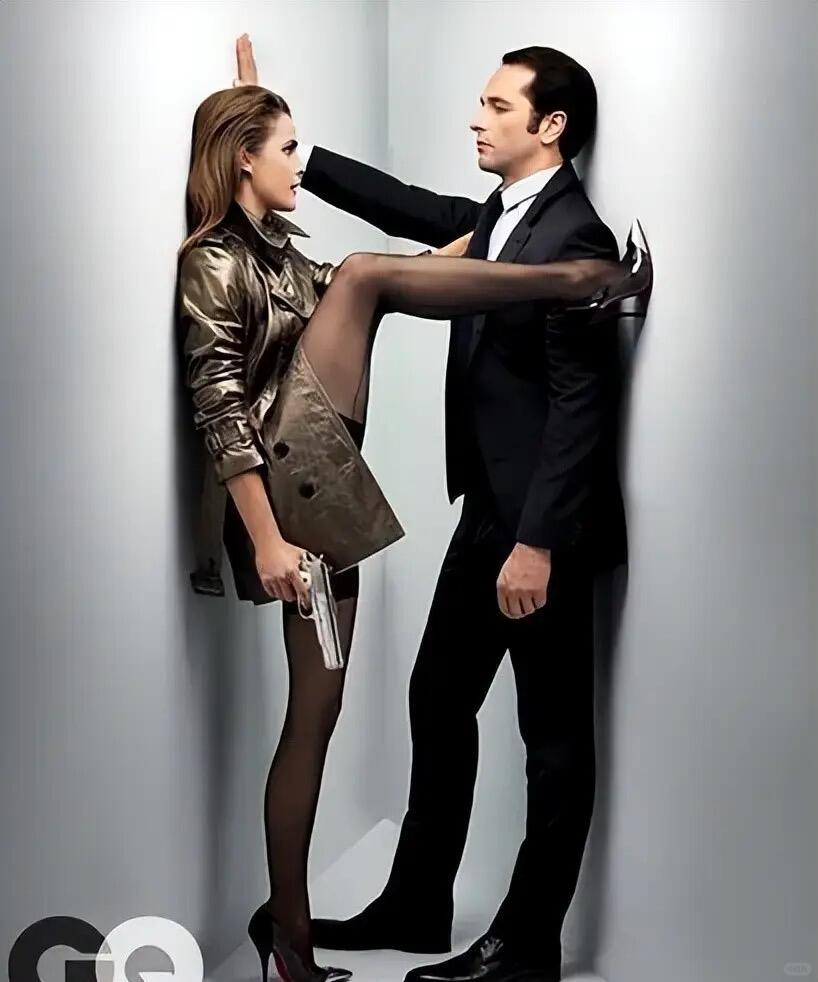
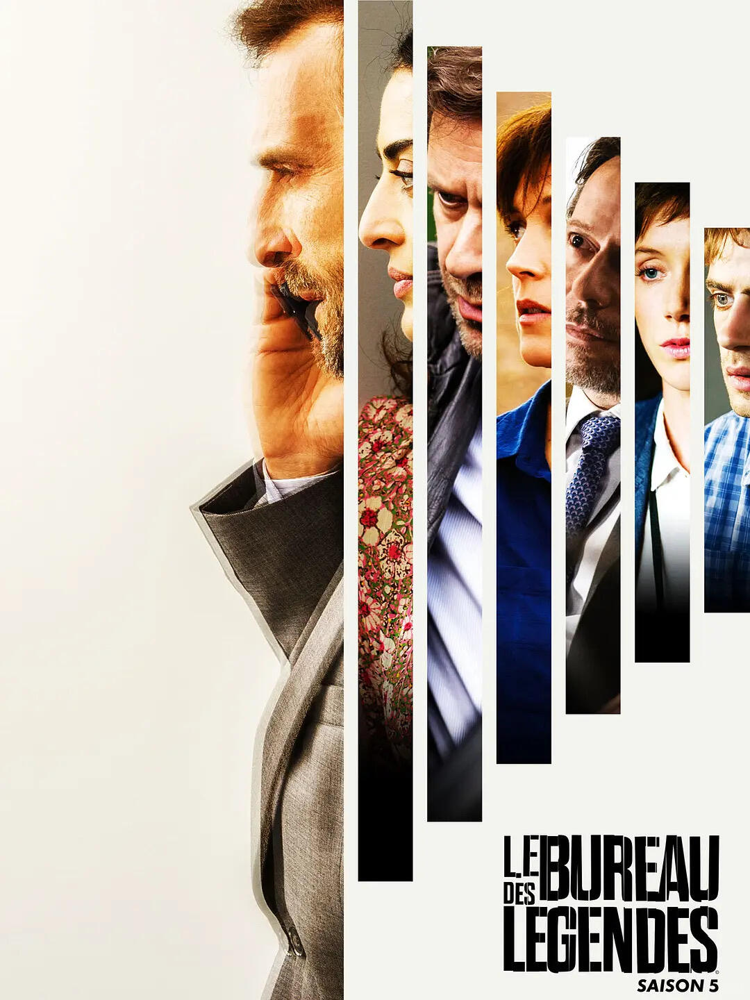
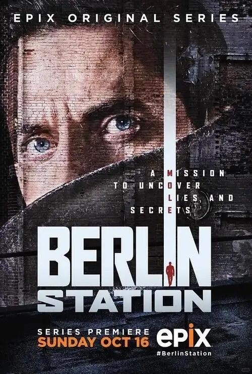

# 谍战剧追剧终极名单推荐，请笑纳~



▎标杆之作，必看推荐（写实主义与人性深度的巅峰）
· 《美国谍梦》——冷战末期夫妻间谍的日常与崩塌，情感密度极高
· 《传奇办公室》——法剧巅峰，职场化谍战的冷静与孤独
· 《柏林情报站》——当代欧洲情报站的道德灰色地带
· 《冷战疑云》——约翰·勒卡雷原著改编，冷战全景史诗
· 《谍海浮沉》——英国情报机构的体制性疲惫与忠诚困境
	
▎人气与争议并存（热度极高，观感两极）
· 《国土安全》——前四季封神，后续争议较大；反恐与躁郁症的共生
· 《流人》——英剧新贵，“废柴”间谍的黑色幽默与悲壮
	
▎写实纯度有争议，但各有亮点
· 《德黑兰》——摩萨德营救行动，地缘政治张力十足，节奏紧凑
· 《夜班经理》——豪华酒店夜班经理卷入军火走私，汤姆·希德勒斯顿与休·劳瑞正邪对峙。视觉精致。好看，好像又不够耐看
	
▎基于真实历史事件，史料价值突出，艺术性上略有取舍
· 《特工科恩》——以色列传奇间谍伊利·科恩的渗透与覆灭
· 《女鼓手》——勒卡雷改编，巴以冲突中的双重陷阱
· 《德国八三年 / 八六年 / 八九年》——冷战末期东德监听与叛逃者的命运
· 《剑桥风云》——剑桥五杰真实原型，英式克制
· 《锅匠、裁缝、士兵、间谍》——勒卡雷经典，体制内抓鼹鼠的极致压抑
· 《伦敦谍影》——本·卫肖饰演的前俱乐部男孩被卷入情报世界，悬疑外壳下是对边缘身份与孤独的本质探寻
· 《巴比伦柏林》——魏玛共和国末期的柏林，警探与打字员卷入政治阴谋与谍战漩涡，黑色电影美学与历史史诗的交融
	
▎非常规路数，偏离传统谍战范式，更偏戏说，也自有其趣味
· 《双面女间谍》——J.J.艾布拉姆斯早期作品，动作科幻元素混搭
· 《少年间谍》——YA向，青春动作片质感
	
▎科幻 / 架空谍战，冷战逻辑在异质设定中的变奏
· 《相对宇宙》——J.K.西蒙斯一人分饰两角，冷战从未结束，只是转移到了平行世界；身份与忠诚的科幻寓言
· 《高堡奇人》——菲利普·K·迪克架空历史改编，轴心国瓜分美国后的地下抵抗，氛围压抑但后期叙事失焦

```
#推荐好剧# #谍战剧##追剧##美剧##英剧##追剧日常#
```




