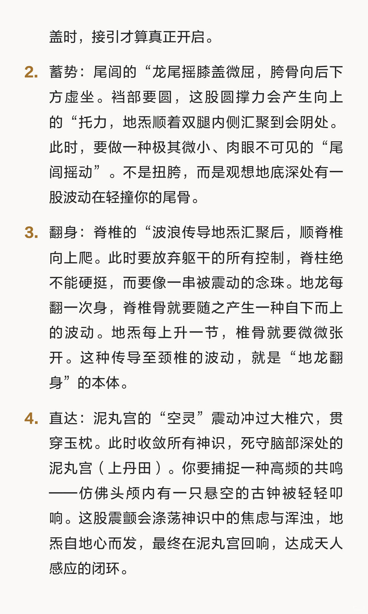

# 《地龙翻身：站桩中的极意，让大地的震颤，


很多人站了一辈子，一站就是一个时辰，除了双腿酸痛、膝盖僵硬，浑身不见半分脱胎换骨的灵动。那是因为你站的是“死桩”——把自己活成了一尊泥菩萨，那是枯坐，不是修行。真正的站桩，是要将双脚化作根须，深扎进坤元深处，去接引那股厚德载物的地炁，让大地的律动透入骨髓，激荡全身。
这便是我们要聊的桩中极意：地龙翻身。

```
#站桩# #修身养性# #传统养生功法# #修行# #经络#
```





