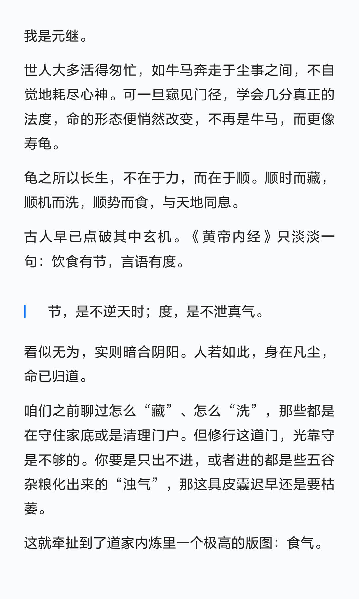
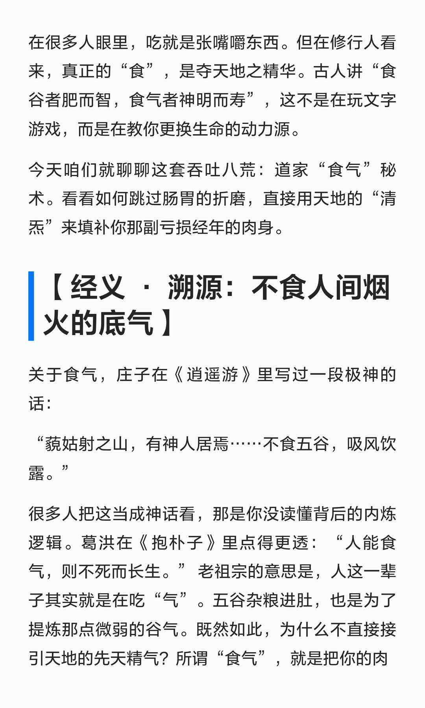
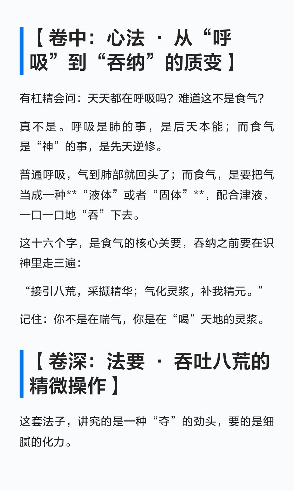
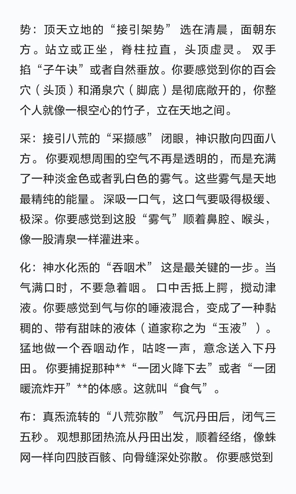
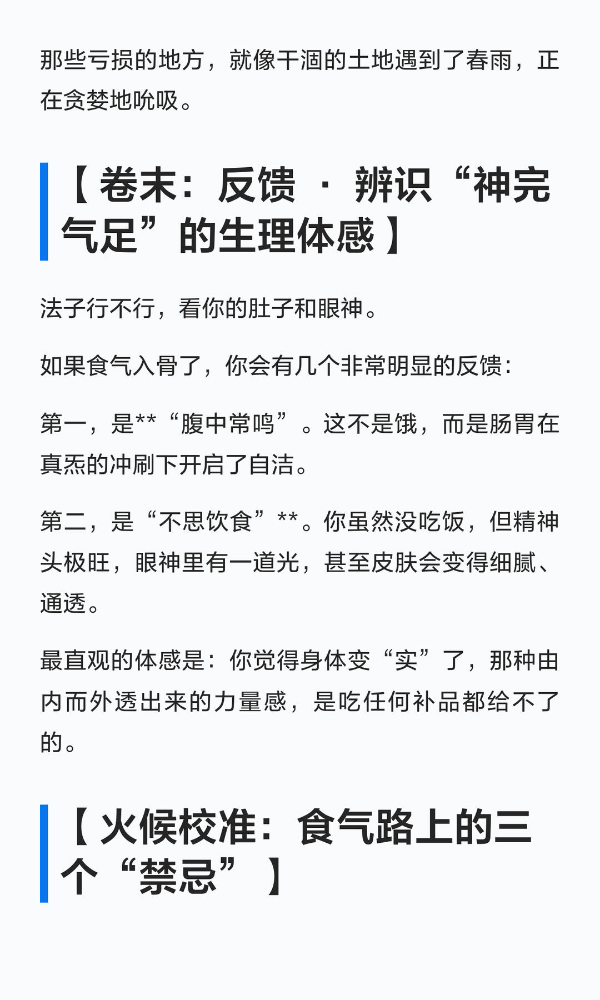

# 吞吐八荒：夺天地精华 补肉身亏损


庄子在《逍遥游》里写过一段极神的话：
“藐姑射之山，有神人居焉……不食五谷，吸风饮露。”
很多人把这当成神话看，那是你没读懂背后的内炼逻辑。葛洪在《抱朴子》里点得更透：“人能食气，则不死而长生。” 老祖宗的意思是，人这一辈子其实就是在吃“气”。五谷杂粮进肚，也是为了提炼那点微弱的谷气。既然如此，为什么不直接接引天地的先天精气？所谓“食气”，就是把你的肉身变成一个吸积盘，直接捕捉宇宙中那些最高频、最纯净的能量。
吞吐八荒：道家“食气””秘术 夺天地精华 补肉身亏损。

```
#修行# #修身养性# #天之道损有余而补不足# #天地之间的自然能量是大补#
```










