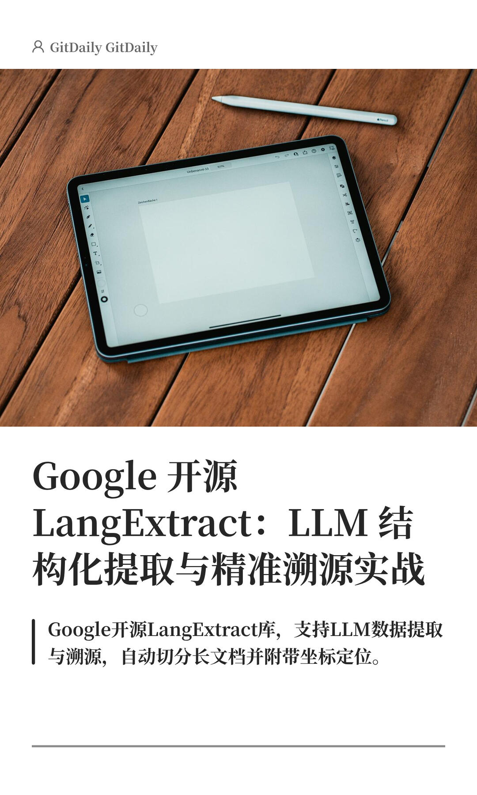

# Google 开源 LangExtract：LLM 提取与溯源



Google 开源 LangExtract 库，专治 LLM 数据提取中的“胡编乱造”和“无处可查”。它支持长文本自动切分、多模型接入，最重要的是能返回精确的字符坐标，让每一条提取的数据都能在原文找到出处，是构建靠谱 ETL 流程的利器。
	
标签：

```
#LangExtract# #数据清洗# #LLM# #Python# #Google# #结构化数据提取# #数据提取# #长文本处理# #多模型# #ETL#
```


