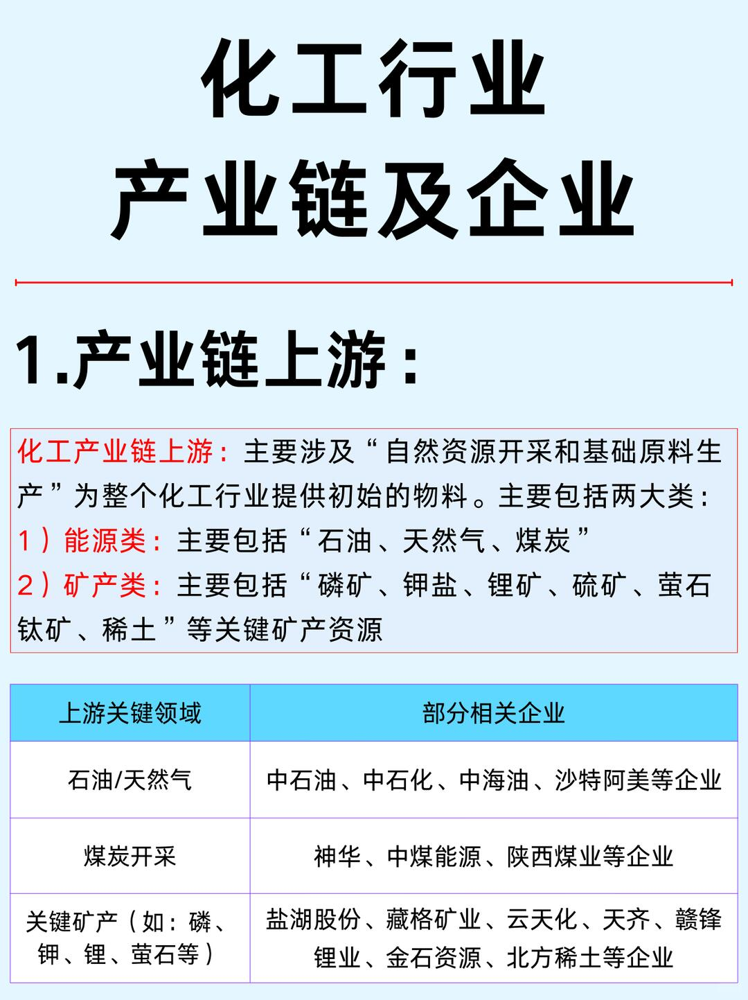
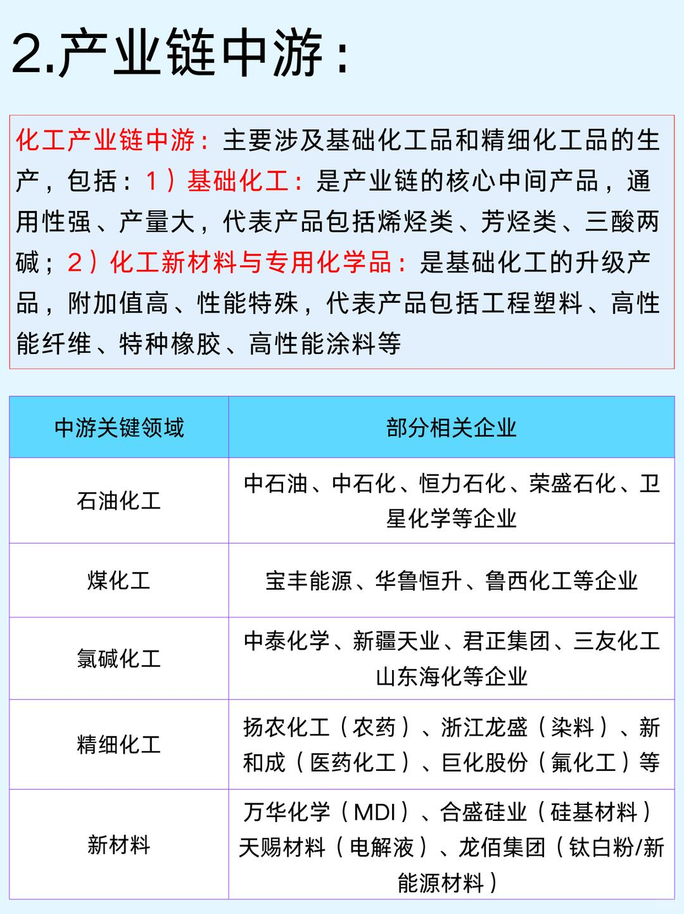
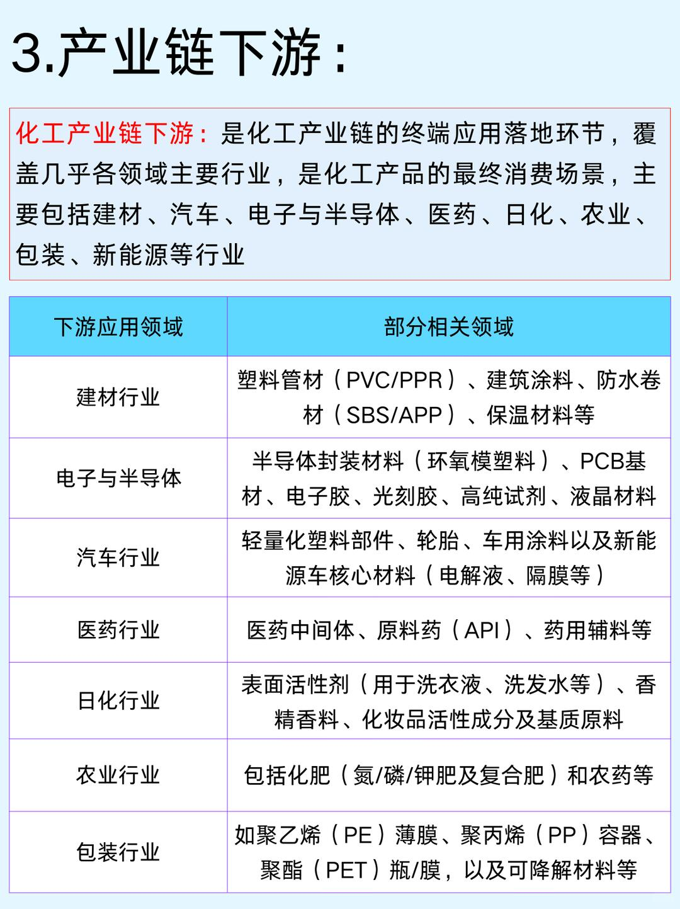
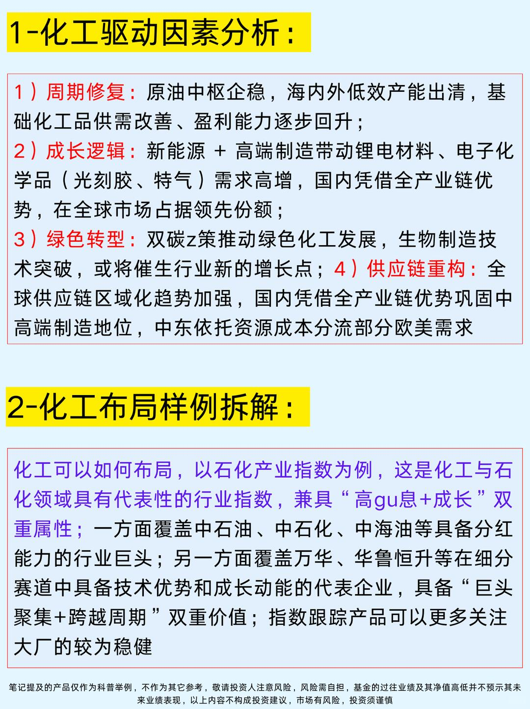
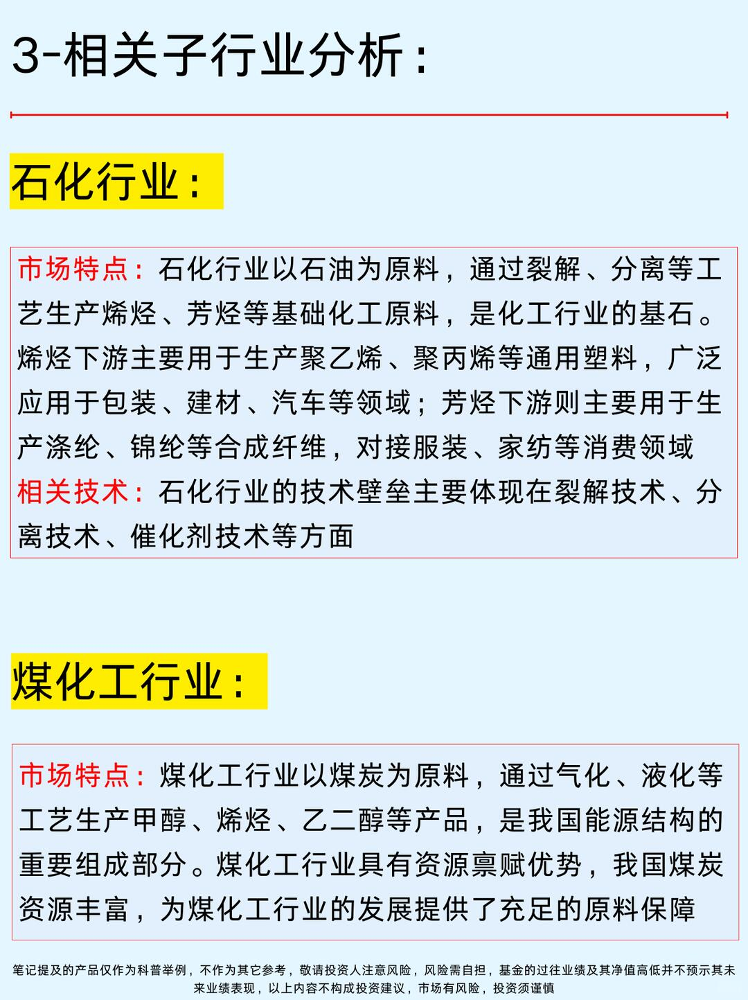
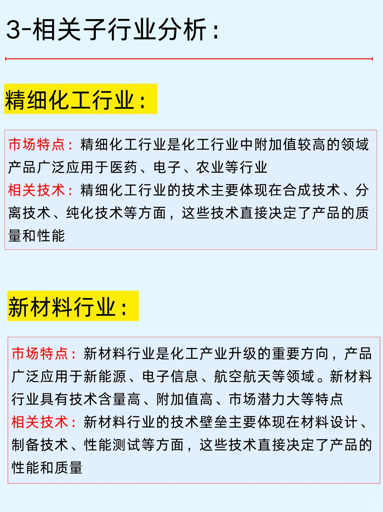

# 一篇吃透：化工产业链及相关企业



本篇笔记概况
图一：介绍化工产业链上游及细分领域企业
化工产业链上游主要涉及“自然资源开采和基础原料生产”为整个化工行业提供初始的物料。
主要包括两大类：
1）能源类：主要包括石油、天然气、煤炭
2）矿产类：主要包括“磷矿、钾盐、锂矿、硫矿、萤石钛矿、稀土”等关键矿产资源
-
图二：介绍化工产业链中游及中游细分领域代表企业。化工产业链中游主要涉及基础化工品和精细化工品的生产
-
图三：介绍化工产业链下游及细分领域
化工产业链下游是化工产业链的终端应用落地环节，覆盖几乎各领域主要行业，是化工产品的终端消费场景
-
图四：化工驱动因素分析及化工行业相关产品样例
-
图五：化工相关子行业分析（石化行业、煤化工行业）
-
图六：相关子行业分析（精细化工行业、新材料行业）
-
笔记提及的产品仅作为文章科普举例，不作为其它参考，敬请投资人注意风险，风险需自担，以上内容均不构成投资建议，市场有风险，投资须谨慎

```
#行业研究# #科普知识# #企业# #认知提升# #知识点总结# #学习分享# #化工# #商业思维# #不懂就问有问必答#
```







