# 化工各细分领域龙头梳理

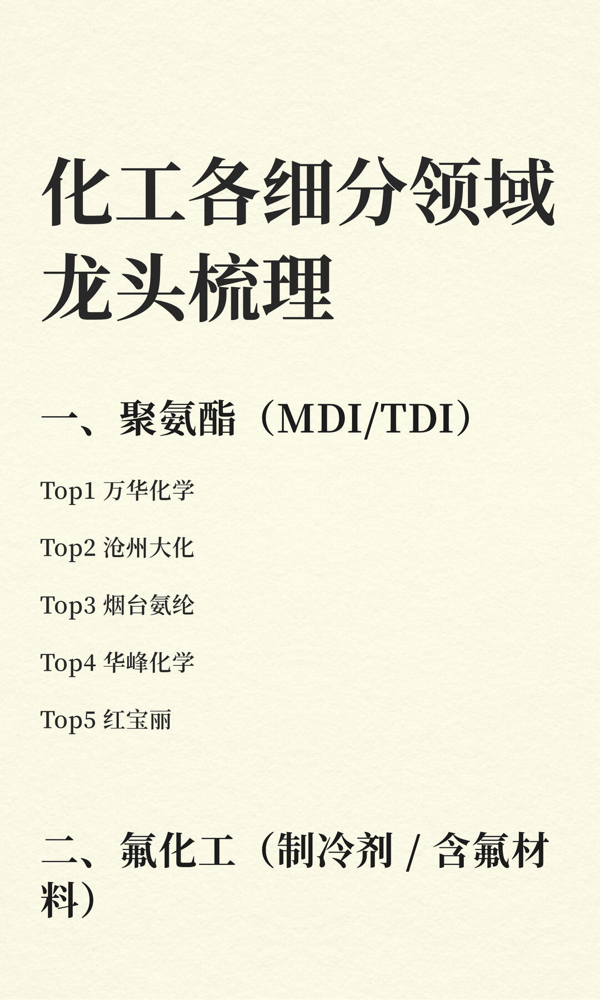

化工各细分领域龙头梳理
一、聚氨酯（MDI/TDI）
Top1 万华化学
Top2 沧州大化
Top3 烟台氨纶
Top4 华峰化学
Top5 红宝丽
二、氟化工（制冷剂 / 含氟材料）
Top1 巨化股份
Top2 三美股份
Top3 永和股份
Top4 东岳集团
Top5 多氟多
三、有机硅（工业硅 / 硅氧烷）
Top1 合盛硅业
Top2 新安股份
Top3 东岳硅材
Top4 兴发集团
Top5 硅宝科技
四、磷化工（磷肥 / 磷酸 / 磷系新材料）
Top1 云天化
Top2 兴发集团
Top3 湖北宜化
Top4 川恒股份
Top5 川发龙蟒
五、煤化工（煤制烯烃 / 尿素 / DMF）
Top1 华鲁恒升
Top2 宝丰能源
Top3 鲁西化工
Top4 山西焦化
Top5 中煤能源
六、炼化一体化（大炼化 / PTA / 聚酯）
Top1 恒力石化
Top2 荣盛石化
Top3 东方盛虹
Top4 恒逸石化
Top5 卫星化学
七、纯碱 / 烧碱（氯碱 / 纯碱）
Top1 三友化工
Top2 山东海化
Top3 远兴能源
Top4 中泰化学
Top5 滨化股份
八、钾肥（钾盐 / 钾肥）
Top1 盐湖股份
Top2 亚钾国际
Top3 藏格矿业
Top4 东方铁塔
Top5 冠农股份
九、农药（杀虫剂 / 除草剂 / 杀菌剂）
Top1 扬农化工
Top2 利尔化学
Top3 江山股份
Top4 新安股份
Top5 先达股份
十、钛白粉（钛白粉 / 钛材）
Top1 龙佰集团
Top2 中核钛白
Top3 金浦钛业
Top4 攀钢钒钛
Top5 安纳达
十一、染料（分散 / 活性染料）
Top1 浙江龙盛
Top2 闰土股份
Top3 安诺其
Top4 锦鸡股份
Top5 雅运股份
十二、氨纶 / 化纤（氨纶 / 聚酯纤维）
Top1 华峰化学
Top2 烟台氨纶
Top3 桐昆股份
Top4 荣盛石化
Top5 恒逸石化
十三、电子化学品（半导体 / 锂电材料）
Top1 新宙邦
Top2 天赐材料
Top3 多氟多
Top4 华特气体
Top5 安集科技
点个关注，下一篇更精彩！
【本文由投资顾问李世雄 执业编号:A0600621030009编辑整理，内容仅代表个人观点，不表明对相关产品服务的风险和收益做出实质性判断或保证，您须独立作出投资决策，风险自担。】

```
#财经# #股票# #股票干货# #财经知识# #股市小白#
```


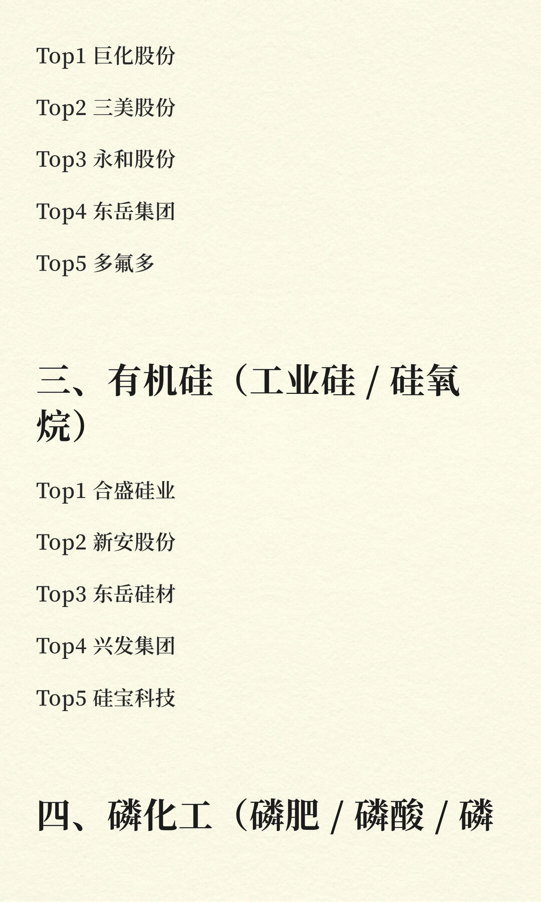
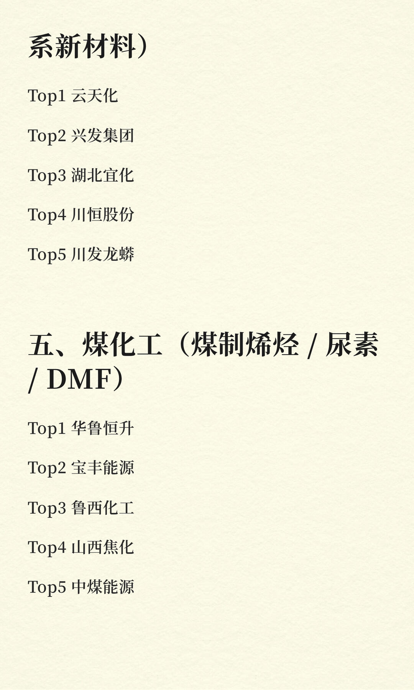
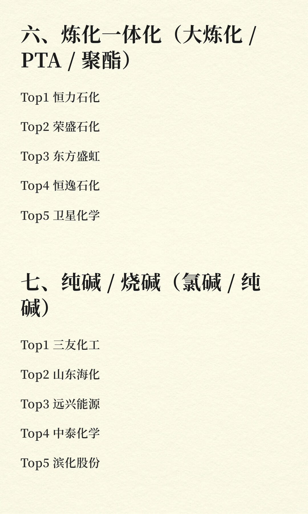
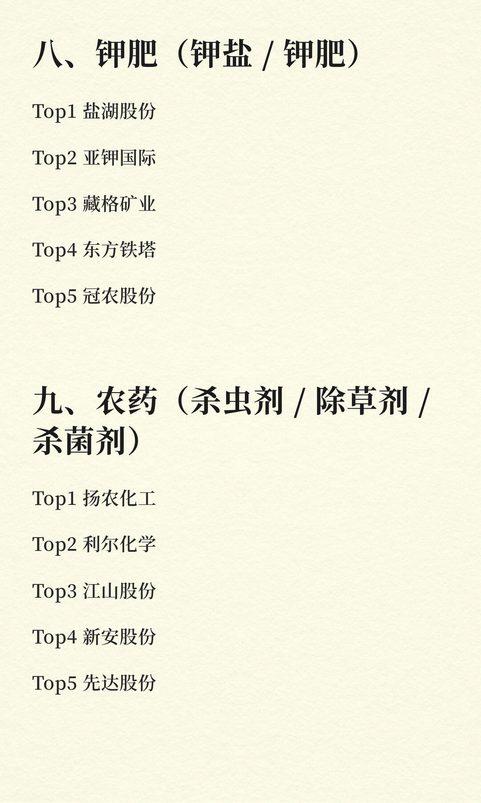
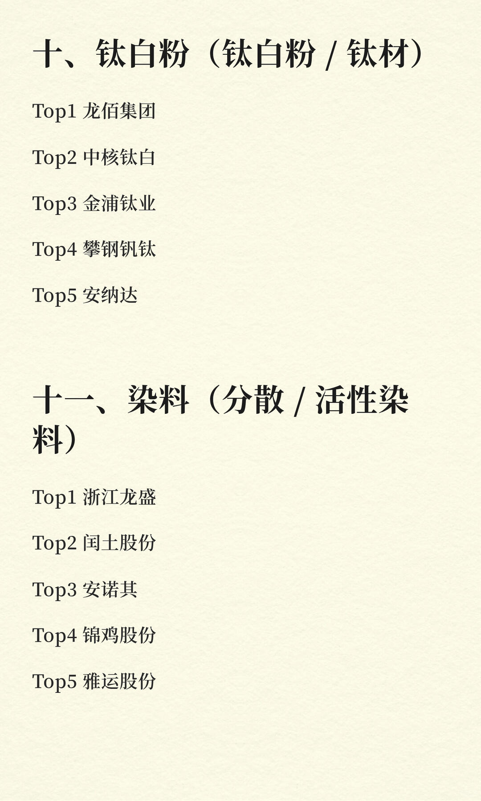
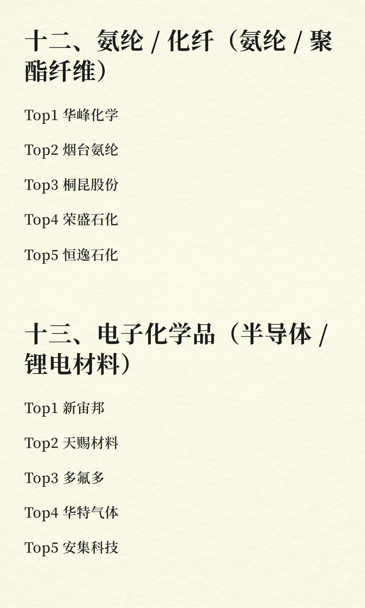
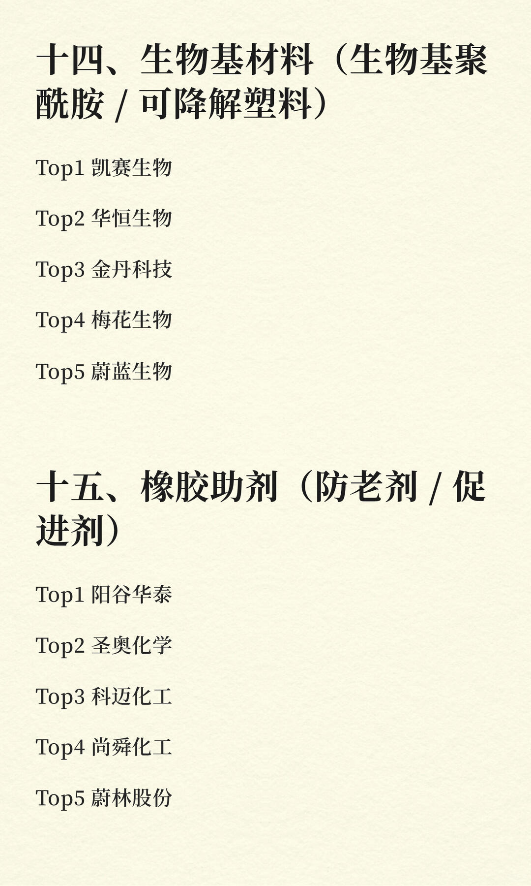
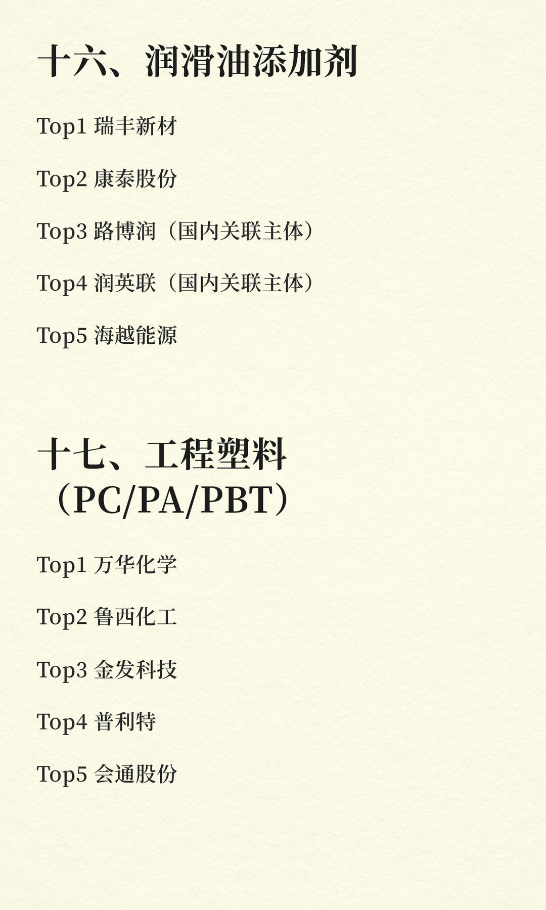
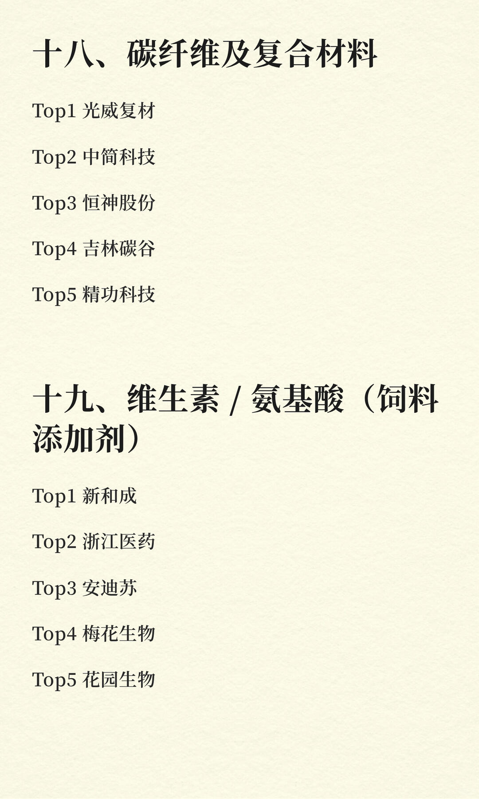
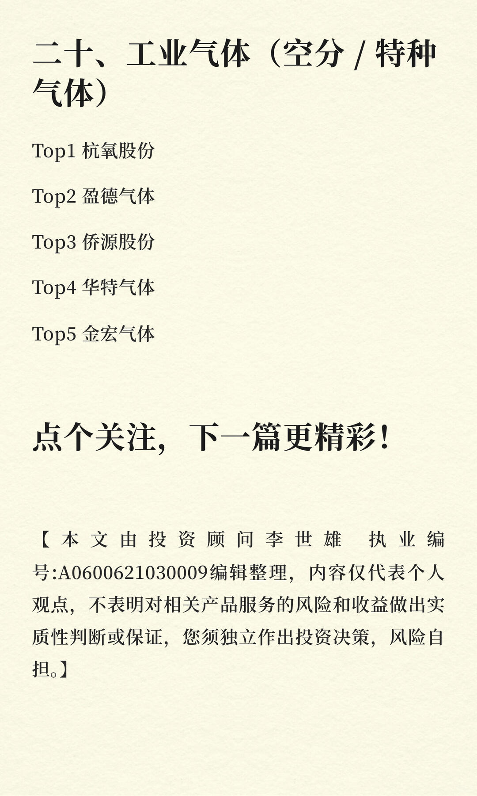
