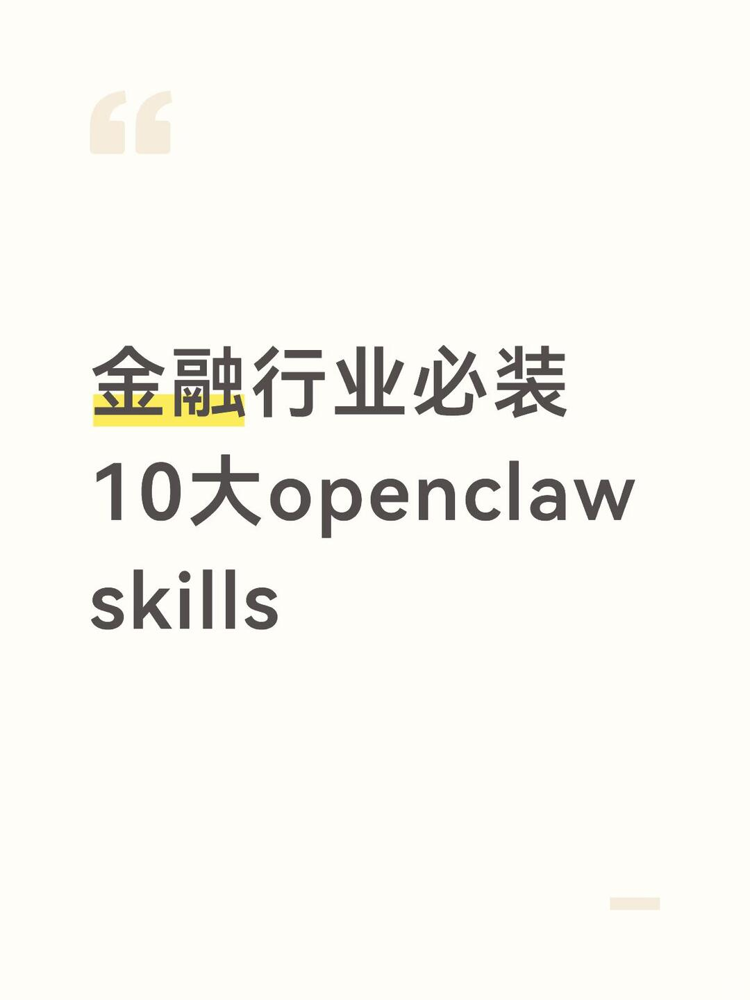

# 金融行业必装10大openclaw skills



🏦 金融行业必装的 10 大 OpenClaw Skills 以下技能复制即可安装，实测可用 ✅ ───
	
1、📉 Stock Monitor（股票监控告警） 🔗 clawhub.com/skills/stock-m… 实时监控自选股异动，价格突破、涨跌停、成交量异常时自动推送告警。 核心能力：价格告警 · 涨停监控 · 量能异动 · 自定义触发条件 ───
	
2、🖥eastmoney-financial-search（资讯搜索）🔗https://marketing.dfcfs.com/views/finskillshub/index14Frs12Y?appfenxiang=1用于获取涉及时效性信息或特定事件信息的任务，包括新闻、公告、研报、政策、交易规则、具体事件、各种影响分析、以及需要检索外部数据的非常识信息等
	
3、🀄eastmoney-financial-data（权威金融数据）🔗https://marketing.dfcfs.com/views/finskillshub/index14Frs12Y?appfenxiang=1金融数据查询技能包，提供最及时权威的金融数据：通过自然语言查询股票、板块、指数、基金、债券的行情、主力资金、估值等数据。也可提供上市、非上市公司的公司基本信息、财务、高管、公司主营业务、股东、融资等数据───
	
4、💹eastmoney-select-stock（智能选股）🔗https://marketing.dfcfs.com/views/finskillshub/index14Frs12Y?appfenxiang=1智能选股技能包，用于通过行情、财务指标、技术信号、主营业务、主要产品等筛选股票，支持A股、港股、美股───

```
#openclaw# #投行# #金融知识# #金融##大模型##养龙虾# #养龙虾教程#
```


