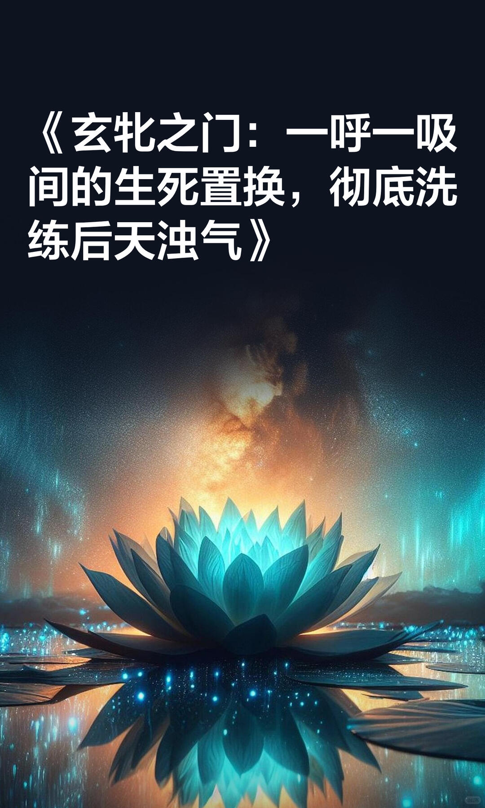
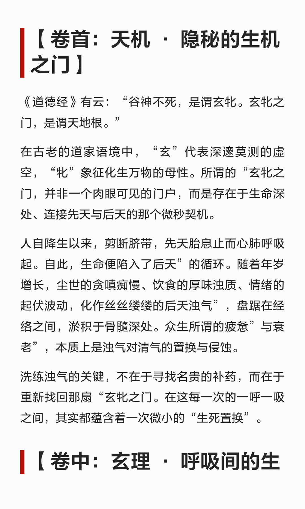
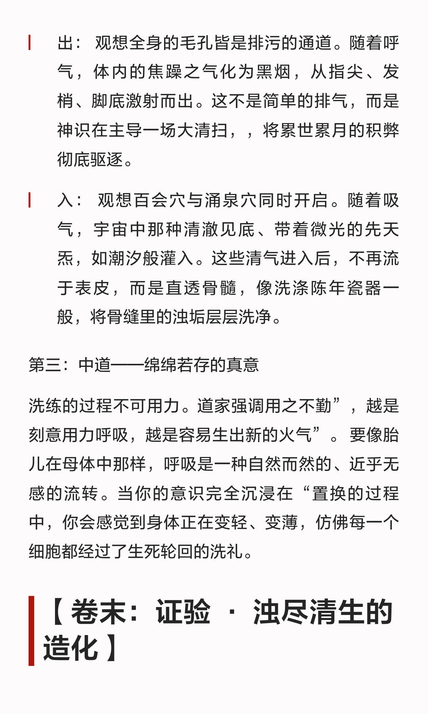
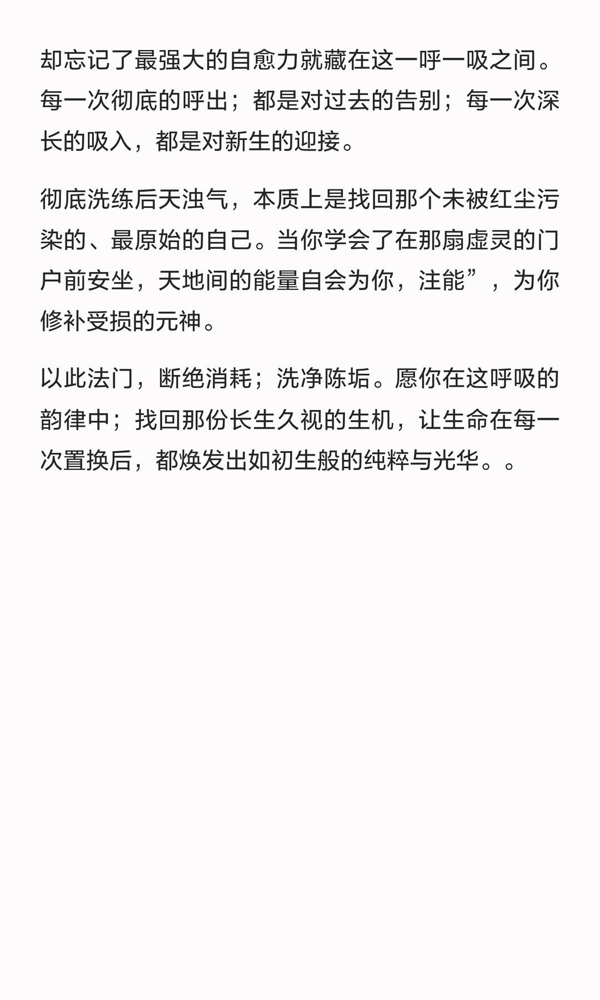

# 《玄牝之门：一呼一吸间的生死置换，彻底洗



《道德经》有云：“谷神不死，是谓玄牝。玄牝之门，是谓天地根。”
在古老的道家语境中，“玄”代表深邃莫测的虚空，“牝”象征化生万物的母性。所谓的“玄牝之门”，并非一个肉眼可见的门户，而是存在于生命深处、连接先天与后天的那个微秒契机。
人自降生以来，剪断脐带，先天胎息止而心肺呼吸起。自此，生命便陷入了“后天”的循环。随着年岁增长，尘世的贪嗔痴慢、饮食的厚味浊质、情绪的起伏波动，化作丝丝缕缕的“后天浊气”，盘踞在经络之间，淤积于骨髓深处。众生所谓的“疲惫”与“衰老”，本质上是浊气对清气的置换与侵蚀。
洗练浊气的关键，不在于寻找名贵的补药，而在于重新找回那扇“玄牝之门”。在这每一次的一呼一吸之间，其实都蕴含着一次微小的“生死置换”。

```
#修身养性# #一切有为法如梦幻泡影# #悟性和灵性# #天地之间的自然能量是大补#
```








