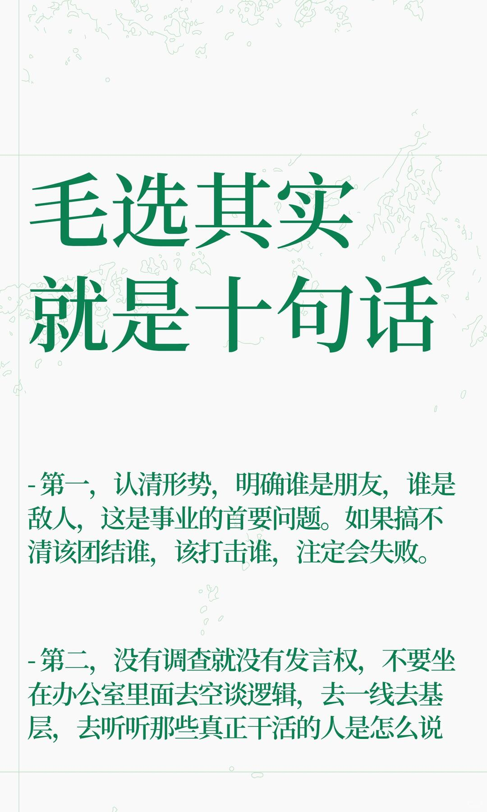
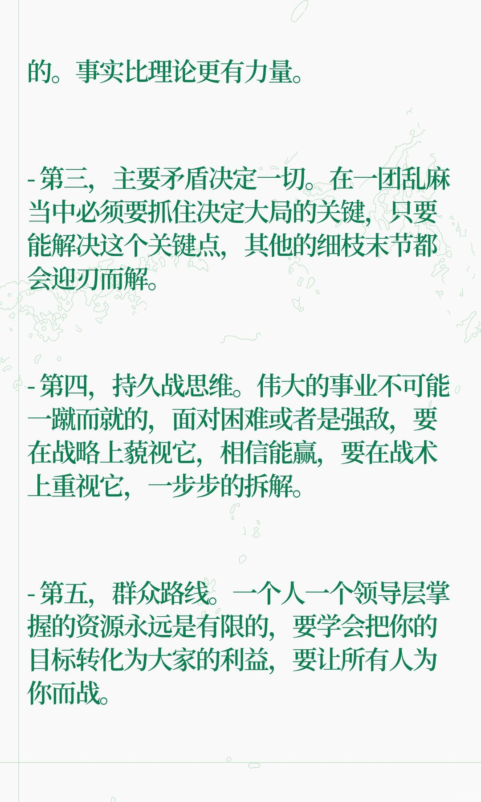
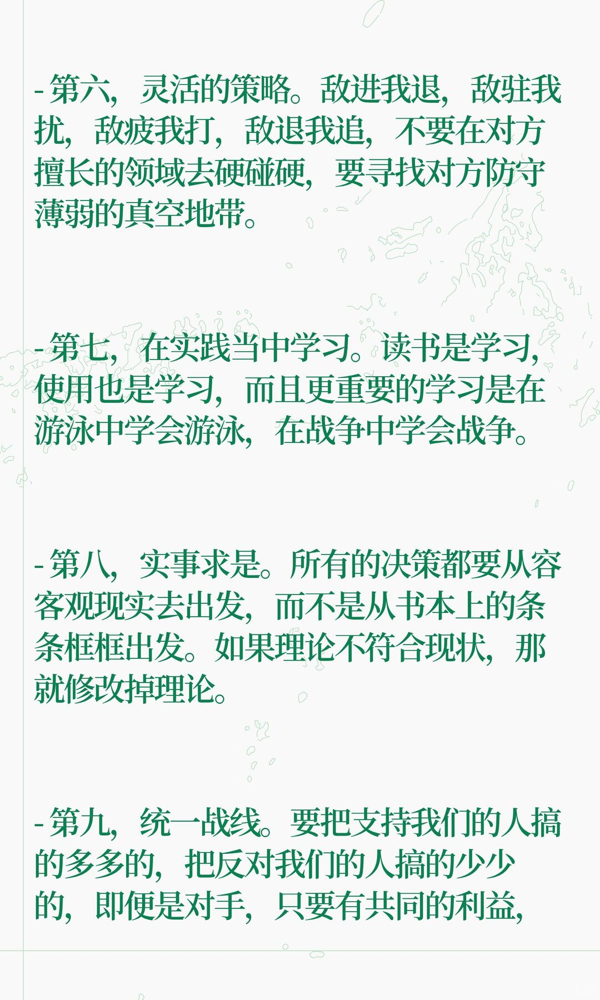

# 毛选其实就是十句话

- 第一，认清形势，明确谁是朋友，谁是敌人，这是事业的首要问题。如果搞不清该团结谁，该打击谁，注定会失败。
- 第二，没有调查就没有发言权，不要坐在办公室里面去空谈逻辑，去一线去基层，去听听那些真正干活的人是怎么说的。事实比理论更有力量。
- 第三，主要矛盾决定一切。在一团乱麻当中必须要抓住决定大局的关键，只要能解决这个关键点，其他的细枝末节都会迎刃而解。
- 第四，持久战思维。伟大的事业不可能一蹴而就的，面对困难或者是强敌，要在战略上藐视它，相信能赢，要在战术上重视它，一步步的拆解。
- 第五，群众路线。一个人一个领导层掌握的资源永远是有限的，要学会把你的目标转化为大家的利益，要让所有人为你而战。
- 第六，灵活的策略。敌进我退，敌驻我扰，敌疲我打，敌退我追，不要在对方擅长的领域去硬碰硬，要寻找对方防守薄弱的真空地带。
- 第七，在实践当中学习。读书是学习，使用也是学习，而且更重要的学习是在游泳中学会游泳，在战争中学会战争。
- 第八，实事求是。所有的决策都要从容客观现实去出发，而不是从书本上的条条框框出发。如果理论不符合现状，那就修改掉理论。
- 第九，统一战线。要把支持我们的人搞的多多的，把反对我们的人搞的少少的，即便是对手，只要有共同的利益，也可以阶段性的合作。
- 第十，自我革新。房子不打扫会落满灰尘，脸不洗会变脏，只有不断的进行批评与自我批评，一个团队才能保持长久的战斗力。

