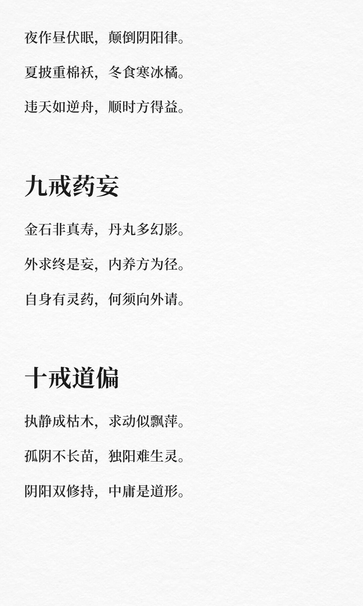

# 道家十戒


养生需戒神驰、气耗、精漏、形劳、食浊、居逆、情极、时违、药妄和道偏。通过收摄心念、调和气息、固守精气、适度劳逸、选择清淡饮食、顺应自然环境、控制情绪、遵循自然规律、避免盲目求药和保持中庸之道，才能真正养护生命，达到养生的最高境界。
	
十戒如明镜，照见众生病。
养生非加法，避损即修真。
戒中自有生发机，损尽方能见道心。
不犯天和即是补，顺乎自然最为珍。

```
#道德经# #文化疗愈# #疗愈# #道德经智慧# #道家# #养生#
```



