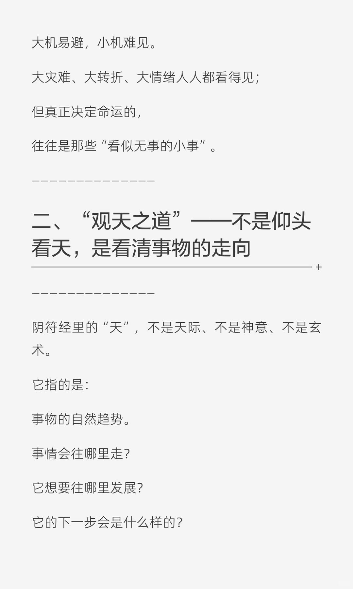
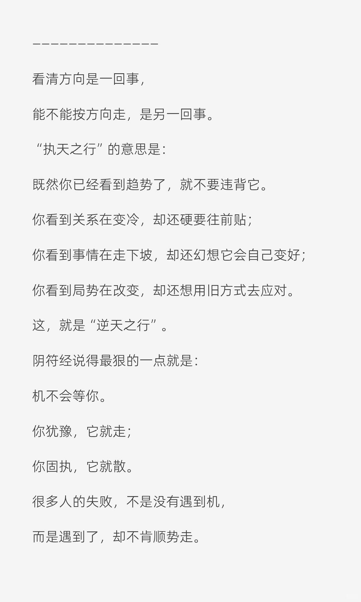

# 阴符经十讲 ·第二讲  观天之道，执天之


一、什么是“机”？——不是机会，是正在发生的方向 ——————————————
机，不是“好运气”， 也不是“危险预兆”。
它是—— 一件事刚刚要变化时，那一点最细微的信号。
你心里忽然的一动、 关系出现的一丝不顺、 空气里说不上来的那一点暗涌、 你突然升起的那点不安、 或你突然松下来的一口气。
这些都是“机”。

```
#道家文化# #道法自然随缘自在# #修身养性#
```







